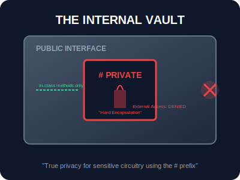
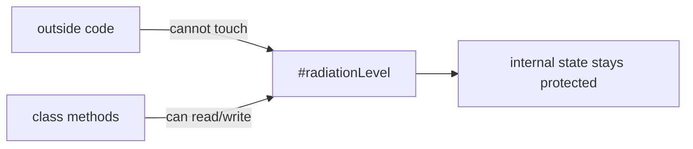

# SEC-01: Private Fields (The Internal Vault)

> **"Tidak semua bagian dari Hub Energi boleh disentuh oleh operator luar. Beberapa kabel sangat berbahaya dan sensitif. Private Fields adalah 'Brankas Internal' (Internal Vault) yang dikunci rapat menggunakan simbol `#`, memastikan tidak ada gangguan dari luar yang bisa merusak logika inti unit."**

**Private Fields** (ditandai dengan awalan `#`) adalah fitur JavaScript modern yang memberikan enkapsulasi tingkat keras. Properti atau metode yang ditandai dengan `#` hanya bisa diakses dan dimodifikasi dari dalam tubuh (*body*) class tersebut.

## Source Hub
- [MDN Web Docs - Private elements](https://developer.mozilla.org/en-US/docs/Web/JavaScript/Reference/Classes/Private_elements)
- [MDN Web Docs - Classes](https://developer.mozilla.org/en-US/docs/Web/JavaScript/Reference/Classes)

---

## 1. Mental Model: "The Internal Vault"

Bayangkan sebuah unit generator dengan Panel Kontrol publik di bagian depan. 
- **Public**: Tombol `start()` dan `stop()` yang bisa ditekan siapa saja.
- **Private**: Brankas baja `#coreData` di dalam unit. 

Hanya sirkuit internal generator tersebut yang memiliki kunci untuk membuka brankas tersebut. Bahkan jika unit lain mencoba "mengintip" atau memodifikasi energi di dalamnya secara langsung, sistem akan memblokir akses tersebut secara permanen.





---

## 2. Implementasi Sintaksis `#`

Untuk membuat field menjadi private, Anda wajib mendeklarasikannya di bagian atas class sebelum constructor.

```javascript
class NuclearReactor {
    #radiationLevel = 0; // Private Field

    constructor(initialLevel) {
        this.#radiationLevel = initialLevel;
    }

    #calculateRisk() { // Private Method (ES2020+)
        return this.#radiationLevel > 100 ? "HIGH" : "LOW";
    }

    reportSafety() {
        return `Risk is ${this.#calculateRisk()}`;
    }
}
```

---

## 3. Keunggulan Arsitektural

- **Hard Encapsulation**: Berbeda dengan konvensi `_underscore` (yang hanya peringatan visual), `#` memberikan proteksi level bahasa.
- **Integritas State**: Menjamin bahwa status internal unit tidak bisa dirusak oleh logika luar yang tidak terduga.
- **Pewarisan Terbatas**: Ingat bahwa sub-class **tidak bisa** mengakses private fields dari class induknya. Ini menjaga agar logika inti tetap terisolasi bahkan dalam hirarki yang kompleks.

---

## Arsitek Mindset: Prinsip Hak Akses Minimum

Sebagai arsitek Hub:
- **Private by Default**: Mulailah semua properti sebagai private. Ubah menjadi publik hanya jika benar-benar ada kebutuhan operasional dari luar.
- **Validation Gate**: Gunakan private fields untuk menyimpan data mentah, dan berikan akses luar melalui metode publik (Getters/Setters) yang sudah dilengkapi validasi.
- **Clean API**: Dengan menyembunyikan detail internal, API class Anda akan terlihat jauh lebih bersih dan mudah dipahami oleh operator lain.

---

## Hands-on: Lab Sirkuit Terisolasi
Eksperimen dengan perlindungan data inti dan metode rahasia di `examples/private_circuit_lab.js`.

---
*Status: [status.md](../../../status.md)*
