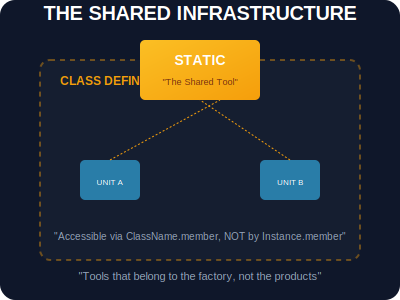

# SEC-02: Static Members (The Shared Infrastructure)

> **"Beberapa alat di Hub tidak menempel pada unit generator individu. Alat-alat ini berada di 'Pusat Infrastruktur' (Shared Infrastructure) dan bisa digunakan oleh semua orang tanpa perlu membangun unit baru. Static Members adalah peralatan markas yang bersifat global bagi seluruh class."**

Member **static** (metode atau properti) adalah member yang dimiliki oleh Class itu sendiri, bukan oleh instansi (objek) yang dihasilkan dari class tersebut.

---

## 1. Mental Model: "The Shared Infrastructure"

Bayangkan sebuah pabrik produksi unit energi.
- **Instance Property**: Serial Number (Setiap unit punya nomor unik sendiri).
- **Instance Method**: `charge()` (Setiap unit mengisi dayanya sendiri).
- **Static Member**: Mesin Derek Pabrik. Hanya ada satu di pabrik. Derek ini bisa digunakan untuk memindahkan unit mana pun, tapi derek tersebut bukan bagian dari komponen unit itu sendiri. Ia adalah infrastruktur bersama milik pabrik (Class).



---

## 2. Inisialisasi & Akses Statis

Kita menggunakan kata kunci `static` untuk mendeklarasikan properti atau metode yang ingin kita jadikan milik bersama.

```javascript
class PowerHub {
    static GRID_STABILITY = "HIGH"; // Properti Statis

    static calculateEfficiency(input, output) { // Metode Statis
        return (output / input) * 100;
    }
}

// Akses langsung via NAMA CLASS
console.log(PowerHub.GRID_STABILITY);
```

---

## 3. Aturan Main Arsitektur

- **No Instance Access**: Member statis **TIDAK** bisa diakses melalui instansi objek (`unit.calculateEfficiency()` akan error).
- **Static `this`**: Di dalam metode statis, kata kunci `this` merujuk pada **Class** itu sendiri, bukan pada instansi objek.
- **Factory Pattern**: Metode statis sangat ideal untuk membuat fungsi pembantu yang memproduksi instansi class dengan konfigurasi khusus.

---

## Arsitek Mindset: Peralatan Markas

Sebagai arsitek Hub:
- **Utility Logic**: Gunakan metode statis untuk logika yang bersifat umum dan tidak membutuhkan data dari satu unit spesifik (misal: konversi unit, kalkulasi berat).
- **Global Configuration**: Simpan konstanta global sistem di dalam properti statis agar mudah dikelola dan tidak tersebar di banyak tempat.
- **Namespace Cleanliness**: Dengan meletakkan fungsi pembantu di dalam class asalnya sebagai `static`, Anda menjaga agar grid global tetap bersih dari fungsi-fungsi yang berceceran.

---

## Hands-on: Lab Infrastruktur Bersama
Gunakan berbagai peralatan global yang disediakan langsung oleh markas di `examples/control_tower_lab.js`.

---
*Status: [status.md](../../../status.md)*
