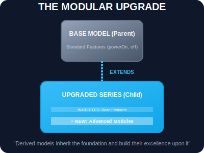

# SEC-01: Extends (The Modular Upgrade)

> **"Anda tidak perlu mendesain unit dari nol setiap kali ada kebutuhan baru. Cukup ambil Model Dasar yang sudah stabil dan lakukan 'Upgrade Modular' (Modular Upgrade). Kata kunci `extends` memungkinkan model baru mewarisi seluruh kemampuan model lama sambil menambahkan fitur-fitur uniknya sendiri."**

Pewarisan (*inheritance*) dalam JavaScript memungkinkan sebuah class untuk mewarisi properti dan metode dari class lain. Ini adalah fondasi dari penggunaan kembali kode (*code reuse*) yang efisien di dalam Hub.

---

## 1. Mental Model: "The Modular Upgrade"

Bayangkan Hub memiliki **Model Dasar** (`BaseModule`) yang memiliki kemampuan standar seperti `powerOn()` dan `statusReport()`.
- Untuk membuat **Model Turbo**, Anda tidak perlu menggambar ulang skema kelistrikan dasar.
- Anda cukup menggunakan `class TurboModule extends BaseModule`.
- `TurboModule` secara otomatis memiliki semua kemampuan dasar, namun Anda menambahkan mesin "Turbo" baru di atasnya.



---

## 2. Hubungan "Is-A" (Adalah-Sebuah)

Prinsip utama dalam menggunakan `extends` adalah hubungan "Is-A".
- `TurboModule` **adalah sebuah** `BaseModule`.
- `SolarGenerator` **adalah sebuah** `EnergySource`.

Jika hubungan ini tidak masuk akal, maka pewarisan mungkin bukan alat yang tepat (pertimbangkan Komposisi).

```javascript
class BaseUnit {
    constructor(id) { this.id = id; }
    identify() { return `Unit ID: ${this.id}`; }
}

// Mewarisi kemampuan BaseUnit
class SpecializedProcessor extends BaseUnit {
    compute() { return "Processing complex data grid..."; }
}
```

---

## 3. Rantai Prototype (The Lineage)

Saat Anda menggunakan `extends`, JavaScript secara otomatis menghubungkan `SpecializedProcessor` ke `BaseUnit` dalam sebuah "Garis Keturunan" (*Prototype Chain*). Jika sistem tidak menemukan sebuah metode di dalam unit khusus, ia akan naik satu tingkat ke blueprint dasar untuk mencarinya.

---

## Arsitek Mindset: Hierarki yang Sehat

Sebagai arsitek Hub:
- **shallow Hierarchies**: Pertahankan hierarki yang dangkal (maksimal 2-3 tingkat). Semakin dalam pewarisan, semakin sulit melacak asal-usul sebuah bug.
- **DRY (Don't Repeat Yourself)**: Gunakan `extends` untuk menyalurkan logika umum ke satu tempat (Base Class).
- **Consistency**: Pastikan unit anak tidak merusak kontrak yang sudah dijanjikan oleh unit induk (Liskov Substitution Principle).

---

## Hands-on: Lab Seri Model
Pelajari bagaimana kita membangun unit pemroses data khusus yang dikembangkan dari pondasi energi dasar di `examples/model_series_lab.js`.

---
*Status: [status.md](../../../status.md)*
