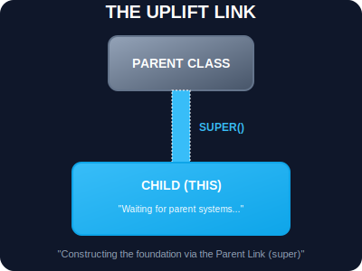

# SEC-02: Super (The Uplift Link)

> **"Saat Anda meng-upgrade model unit, terkadang Anda masih butuh bantuan dari sirkuit model lama. Kata kunci `super` adalah 'Kabel Induk' (Uplift Link) yang menghubungkan unit baru Anda ke blueprint asalnya untuk sinkronisasi data dan kemampuan dasar."**

Kata kunci `super` adalah jembatan komunikasi antara class anak (*subclass*) dan class induk (*superclass*). Tanpa jembatan ini, unit anak tidak akan memiliki akses ke fondasi yang dibangun oleh induknya.

---

## 1. Mental Model: "The Uplift Link"

Bayangkan Anda sedang merakit `UpgradeUnit`. Sebelum Anda memasang komponen-komponen baru yang canggih, Anda harus memastikan sirkuit dasar dari `BaseUnit` sudah terpasang. 
- **super()**: Adalah perintah untuk memanggil prosedur perakitan (constructor) dari blueprint induk.
- **super.method()**: Adalah perintah untuk memanggil protokol operasional spesifik yang dimiliki oleh pusat (induk).



---

## 2. Penggunaan di Lini Perakitan (Constructor)

Jika sebuah class anak memiliki constructor sendiri, ia **wajib** memanggil `super()` sebelum menyentuh kata kunci `this`. Ini karena objek `this` sebenarnya diciptakan oleh class induk terlebih dahulu.

```javascript
class IndustrialDrill extends BasicModule {
    constructor(id, drillType) {
        super(id); // Wajib! Memanggil constructor BasicModule
        this.drillType = drillType; // Baru boleh setelah super()
    }
}
```

---

## 3. Method Overriding (Upgrade Protokol)

Terkadang Anda ingin menjalankan protokol induk, tapi dengan tambahan langkah-langkah baru. Anda bisa memanggil metode induk menggunakan `super.methodName()`.

```javascript
class SmartScanner extends BasicModule {
    turnOn() {
        super.turnOn(); // Jalankan sistem dasar (listrik, pendingin)
        console.log("Initializing optical sensors..."); // Tambahan fitur anak
    }
}
```

---

## Arsitek Mindset: Sinkronisasi Blueprint

Sebagai arsitek Hub:
- **Consistency**: Gunakan `super` untuk memastikan unit anak tetap patuh pada standar dasar unit induk. Ini mencegah "Hukum Rimba" di mana setiap unit anak memiliki cara yang berbeda-beda untuk menyalakan sistem dasarnya.
- **Initialization Order**: Selalu ingat urutan perakitan: Induk dulu (`super`), baru Anak (`this`). Melanggar urutan ini akan menyebabkan kegagalan sistem (*ReferenceError*).
- **Maintenance**: Dengan memanggil `super.method()`, jika suatu saat protokol dasar di unit induk diperbarui, unit anak Anda akan otomatis mendapatkan pembaruan tersebut.

---

## Hands-on: Lab Kabel Induk
Eksperimen dengan koordinasi perakitan dan operasional antar hierarki melalui kabel `super` di `examples/parent_link_lab.js`.

---
*Status: [status.md](../../../status.md)*
