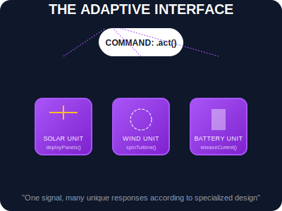

# SEC-03: Polymorphism (The Adaptive Interface)

> **"Pusat Grid dapat mengirimkan satu perintah tunggal 'Operasikan!', namun setiap model unit akan merespons dengan cara yang berbeda sesuai dengan keahliannya. Polymorphism adalah 'Antarmuka Adaptif' (Adaptive Interface) yang memungkinkan standarisasi perintah untuk berbagai jenis unit yang beragam."**

**Polimorfisme** (berasal dari bahasa Yunani yang berarti "banyak bentuk") dalam OOP memungkinkan kita menggunakan antarmuka (nama metode) yang sama untuk berbagai jenis objek yang berbeda, di mana setiap objek memiliki implementasi spesifiknya masing-masing.

---

## 1. Mental Model: "The Adaptive Interface"

Bayangkan Hub memiliki tombol besar di pusat kendali berlabel `ENGAGE`.
- Saat ditekan, sinyal dikirim ke seluruh unit di Grid.
- **Unit Solar**: Merespons dengan membuka panel fotovoltaik.
- **Unit Wind**: Merespons dengan membebaskan rem pada bilah turbin.
- **Unit Battery**: Merespons dengan menutup sirkuit pelepasan arus.

Pusat kendali tidak perlu tahu rincian teknis **bagaimana** masing-masing unit bekerja; ia hanya perlu tahu bahwa semua unit tersebut memiliki fungsi `engage()`.



---

## 2. Implementasi via Method Overriding

Polimorfisme paling sering dicapai melalui pewarisan. Class anak mendefinisikan ulang (*override*) metode yang sudah ada di class induk untuk memberikan perilaku yang lebih spesifik.

```javascript
class EnergyUnit {
    activate() { throw new Error("Method must be implemented!"); }
}

class SolarUnit extends EnergyUnit {
    activate() { console.log("Solar panels deployed."); }
}

class WindUnit extends EnergyUnit {
    activate() { console.log("Wind turbine spinning."); }
}

// Polimorfisme dalam aksi
const units = [new SolarUnit(), new WindUnit()];
units.forEach(u => u.activate()); // Satu perintah, banyak respons!
```

---

## 3. Manfaat Arsitektural

- **Scalability**: Anda bisa menambah jenis unit energi baru (misal: `NuclearUnit`) ke dalam Grid tanpa harus mengubah setetes pun kode di pusat kendali.
- **Simplicity**: Mengurangi percabangan `if/else` atau `switch` yang rumit untuk mengecek jenis unit sebelum memberikan perintah.
- **Interchangeability**: Unit dapat ditukar-tukar selama mereka mematuhi kontrak antarmuka yang sama.

---

## Arsitek Mindset: Standarisasi Kontrak

Sebagai arsitek Hub:
- **Contract Enforcement**: Gunakan polimorfisme untuk menstandarisasi kontrak operasional di seluruh Hub.
- **Signature Consistency**: Pastikan metode yang di-override memiliki jumlah parameter dan tipe kembalian yang sama agar sistem pemanggil tidak bingung.
- **Duck Typing**: Di JavaScript, kita sering menggunakan konsep "Jika ia berjalan seperti bebek dan bersuara seperti bebek, maka ia adalah bebek". Selama objek memiliki metode yang kita butuhkan, sirkuit polimorfik akan tetap berjalan lancar.

---

## Hands-on: Lab Antarmuka Adaptif
Eksperimen dengan perintah massal dan respons unit yang beragam di `examples/polymorphism_lab.js`.

---
*Status: [status.md](../../../status.md)*
