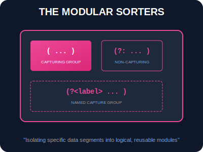

# SEC-02: Groups & Ranges (The Modular Sorters)

> **"Beberapa tanda tangan data memiliki struktur berlapis—seperti nama unit yang diikuti kode wilayah. Groups & Ranges adalah 'Pemilah Modular' (Modular Sorters) yang memungkinkan scanner memilah dan mengambil bagian spesifik dari sebuah temuan utuh ke dalam modul-modul yang bisa digunakan kembali."**

**Groups** dan **Ranges** memberikan kontrol granulasi pada RegExp. Mereka memungkinkan kita tidak hanya menemukan pola, tetapi juga mengidentifikasi sub-struktur di dalamnya untuk ekstraksi data yang lebih cerdas.

---

## 1. Mental Model: "The Modular Sorters"

Bayangkan Anda memindai sebuah paket data besar di Hub.
- **Capturing Groups `( ... )`**: Seperti kotak penyimpanan otomatis. Saat scanner menemukan kecocokan, ia akan menyalin bagian di dalam kurung ke dalam kotak bernomor (Box 1, Box 2, dst) agar Anda bisa mengambilnya nanti.
- **Non-Capturing Groups `(?: ... )`**: Seperti pengelompokan sementara untuk tujuan logika (seperti operator matematika) tanpa perlu membuang energi Hub untuk menyimpannya ke kotak memori.
- **Named Groups `(?<label> ... )`**: Model kotak penyimpanan terbaru yang memiliki label nama permanen daripada sekadar nomor urut.
- **Ranges `[ ... ]`**: Saringan grid yang menentukan karakter mana saja yang diizinkan masuk ke sensor (misal: hanya range `a-z` atau `0-9`).



---

## 2. Teknik Pengelompokan

### A. Capturing & Backreferences
Setiap kurung `()` menyimpan hasilnya. Anda bisa memanggilnya kembali di dalam pola yang sama menggunakan **Backreference** (misal: `\1` untuk Box 1).
```javascript
const duplicateScanner = /(\w+) \1/; // Mencari kata yang berulang: "energy energy"
```

### B. Named Capture Groups (ES2018+)
Sangat disarankan untuk keterbacaan kode arsitektur yang tinggi.
```javascript
const dateScanner = /(?<year>\d{4})-(?<month>\d{2})-(?<day>\d{2})/;
const result = dateScanner.exec("2024-03-21");
console.log(result.groups.year); // "2024"
```

### C. Alternation `|` (The OR Switch)
Memungkinkan scanner memilih salah satu dari beberapa kemungkinan pola.
```javascript
const statusScanner = /online|offline|error/i;
```

---

## Arsitek Mindset: Ekstraksi Terorganisir

Sebagai arsitek Hub:
- **Use Named Groups**: Berikan label pada group Anda. Ini mendokumentasikan diri sendiri tanpa perlu komentar tambahan.
- **Efficiency with Non-Capturing**: Gunakan `(?:...)` jika Anda memproses aliran data jutaan baris dan tidak butuh menyimpan hasil groupnya. Ini menghemat penggunaan memori Hub.
- **Character Class Range**: Gunakan rentang `[a-z0-9]` daripada mencantumkan karakter satu per satu agar pola tetap ringkas.

---

## Hands-on: Lab Pemilahan Modular
Bedah string kompleks menjadi bagian-bagian yang terorganisir menggunakan teknik grouping di `examples/signature_sort_lab.js`.

---
*Status: [status.md](../../../status.md)*
