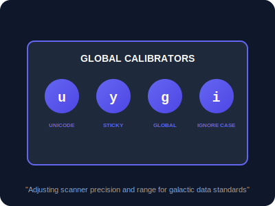

# SEC-03: Flags (The Global Calibrators)

> **"Hub Energi kini meluas ke seluruh galaksi, membawa simbol-simbol dari berbagai bahasa dan sistem data yang berbeda. Flags adalah 'Kalibrator Global' (Global Calibrators) yang menyesuaikan sensitivitas, jangkauan, dan ketelitian scanner Anda terhadap standar data jagat raya."**

**Flags** adalah parameter opsional yang ditambahkan di akhir RegExp (setelah garis miring penutup) untuk mengubah perilaku dasar pencarian pola.

---

## 1. Mental Model: "The Global Calibrators"

Bayangkan pemindai pola Anda memiliki panel kontrol dengan beberapa dial kalibrasi:
- **`g` (Global)**: Scanner tidak langsung berhenti setelah menemukan satu kecocokan; ia akan menyapu seluruh Grid sampai selesai.
- **`i` (Ignore Case)**: Mengabaikan perbedaan antara huruf besar dan kecil.
- **`u` (Unicode)**: Memberikan "Resolusi Tinggi" pada scanner agar bisa mengenali karakter kompleks seperti emoji atau aksara non-Latin.
- **`y` (Sticky)**: Memaksa scanner untuk hanya mencari tepat di posisi saat ini (`lastIndex`), tanpa melompat ke depan. Ini adalah mode "Melekat".

---

## 2. Tabel Dial Kalibrasi

| Flag | Nama | Deskripsi |
| :--- | :--- | :--- |
| **`g`** | Global | Mencari semua kecocokan, bukan hanya yang pertama. |
| **`i`** | Ignore Case | Pencarian tidak peka terhadap besar/kecil huruf. |
| **`m`** | Multiline | Mengubah perilaku `^` dan `$` agar berlaku di tiap awal/akhir baris baru (\n). |
| **`s`** | dotAll | Memungkinkan titik `.` mencocokkan karakter baris baru (\n). |
| **`u`** | Unicode | Penanganan karakter Unicode secara penuh (4-byte characters). |
| **`y`** | Sticky | Pencarian dimulai tepat dari properti `lastIndex` objek tersebut. |

---

## 3. Kekuatan Sticky (y) dalam Parsing
Flag `y` adalah rahasia di balik performa tinggi sistem *Tokenizer* (pemecah kode). Ia menjamin bahwa data ditemukan secara berurutan tanpa ada jeda atau karakter yang terlewat di tengah-tengah aliran data.

---

## Arsitek Mindset: Kalibrasi Strategis

Sebagai arsitek Hub:
- **Default to Unicode**: Selalu gunakan flag `u` jika Hub Anda berurusan dengan input teks dari pengguna luar untuk menghindari error saat memproses emoji atau simbol internasional.
- **Tokenizer Performance**: Gunakan flag `y` jika Anda sedang membangun sistem pemroses log atau parser yang membutuhkan kepastian lokasi dan kecepatan tinggi.
- **Combine Dials**: Anda bisa mengombinasikan beberapa flag sekaligus (misal: `/pattern/giu`) untuk menciptakan scanner yang sangat tangguh dan fleksibel.

---

## Hands-on: Lab Kalibrator Global
Uji sensitivitas scanner Anda terhadap simbol-simbol eksotis dan aturan 'Sticky' di `examples/calibration_flags_lab.js`.

---
*Status: [status.md](../../../status.md)*
