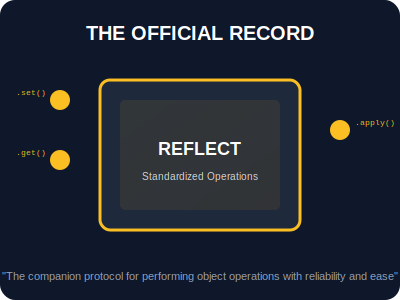

# SEC-02: Reflect API (The Official Record)

> **"Jika Proxy adalah penjaga yang mencegat permintaan, maka Reflect adalah 'Catatan Resmi' (The Official Record) yang menyediakan cara standar dan aman untuk melakukan operasi pada objek tanpa merusak alur internal sistem Hub."**

**Reflect** adalah objek statis built-in yang menyediakan metode untuk mengoperasikan objek dengan cara yang lebih teratur, fungsional, dan dapat diprediksi. Setiap "Trap" pada Proxy memiliki metode yang sesuai di dalam Reflect.

---

## 1. Mental Model: "The Official Record"

Bayangkan Proxy sebagai filter atau penjaga. Setelah filter menyetujui sebuah permintaan (misal: penulisan data), ia harus meneruskannya ke objek asli.
- **Direct Access (`obj[prop] = value`)**: Seperti mencoba membuka brankas secara paksa; jika brankas terkunci (*frozen*), operasi ini akan gagal بصمت (secara diam-diam) atau melempar error yang tidak konsisten.
- **Reflect Access (`Reflect.set(...)`)**: Seperti menggunakan kunci resmi dari Hub. Ia menjamin operasi dilakukan dengan protokol yang benar dan memberikan laporan status (`true/false`) secara eksplisit.



---

## 2. Keunggulan Protokol Reflect

| Fitur | Pendekatan Objek/Operator | Pendekatan Reflect | Manfaat |
| :--- | :--- | :--- | :--- |
| **Nilai Balik** | `delete obj.p` (bisa gagal diam-diam) | `Reflect.deleteProperty(obj, 'p')` | Mengembalikan Boolean (`true/false`) |
| **Konteks `this`** | Manual binding | Parameter `receiver` | Menjaga pewarisan (*inheritance*) tetap akurat |
| **Error Handling** | `Object.defineProperty` (lempar error) | `Reflect.defineProperty` | Mengembalikan Boolean (lebih aman) |
| **Fungsional** | `(x in obj)` | `Reflect.has(obj, x)` | Memudahkan gaya pemrograman fungsional |

---

## 3. Sinergi dengan Proxy: Parameter `receiver`

Salah satu alasan terkuat menggunakan `Reflect` di dalam Proxy adalah parameter `receiver`. Parameter ini memastikan bahwa jika objek target sedang diakses melalui *inheritance* (pewarisan), konteks `this` akan tetap merujuk pada objek akhir yang memanggilnya, bukan pada objek target perantara.

```javascript
const handler = {
    get(target, prop, receiver) {
        // 'receiver' memastikan getter di prototype bekerja dengan 'this' yang benar
        return Reflect.get(target, prop, receiver);
    }
};
```

---

## Arsitek Mindset: Standarisasi Operasi

Sebagai arsitek Hub:
- **Consistency First**: Gunakan `Reflect` setiap kali Anda berada di dalam Proxy Trap. Ini adalah praktik standar industri untuk menghindari bug halus terkait konteks `this`.
- **Functional Style**: Gunakan `Reflect` untuk menggantikan operator lama (`delete`, `in`) jika Anda sedang membangun utilitas yang membutuhkan pemanggilan fungsi (seperti pada `.map()` atau `.filter()`).
- **Safe Definition**: Gunakan `Reflect.defineProperty` jika Anda ingin mencoba mendefinisikan properti tanpa harus membungkus kode Anda dalam blok `try...catch`.

---

## Hands-on: Lab Protokol Cermin
Sempurnakan cara kerja Proxy Anda dan pelajari perbedaan performa serta keamanan antara `Object` dan `Reflect` di `examples/reflect_mirror_lab.js`.

---
*Status: [status.md](../../../status.md)*
