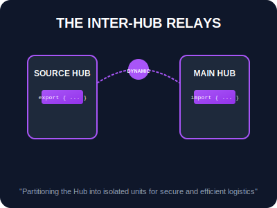

# SEC-01: ES Modules (The Inter-Hub Relays)

> **"Web Energy Hub tidak lagi dibangun sebagai satu blok tunggal yang masif. Modules adalah 'Relai Antar-Hub' (The Inter-Hub Relays) yang memungkinkan kita membagi sistem menjadi unit-unit terisolasi yang bisa dipasang (import) dan dilepas (export) melintasi jaringan Grid dengan aman."**

**ES Modules (ESM)** adalah standar resmi JavaScript untuk pengorganisasian kode. Berbeda dengan skrip tradisional, modul memiliki *scope* terisolasi dan mendukung pemuatan asinkron yang sangat efisien.

---

## 1. Mental Model: "The Inter-Hub Relays"

Bayangkan setiap file `.mjs` adalah sebuah satelit Hub independen:
- **`export` (The Transmitter)**: Mengirimkan teknologi (fungsi, kelas, variabel) agar bisa dideteksi oleh satelit lain.
- **`import` (The Receiver)**: Menangkap transmisi dari satelit lain untuk memperkuat kemampuan satelit sendiri.
- **Static vs Dynamic Logistics**:
    - **Static (`import ...`)**: Sambungan permanen yang dipasang sebelum satelit aktif.
    - **Dynamic (`import()`)**: Sambungan darurat yang dipasang hanya saat dibutuhkan, menghemat cadangan energi sistem.
- **Top-Level Await**: Kemampuan satelit untuk menunggu transmisi data dari luar angkasa sebelum ia benar-benar mengaktifkan sistem internalnya.



---

## 2. Protokol Transmisi

### A. Named vs Default Relays
| Tipe | Pengirim (`export`) | Penerima (`import`) |
| :--- | :--- | :--- |
| **Named** | `export const unit = 1;` | `import { unit } from './hub.js';` |
| **Default** | `export default class {}` | `import MainUnit from './hub.js';` |

### B. Dynamic Logistics (`import()`)
Berguna untuk *Code Splitting*—memuat modul hanya saat pengguna menekan tombol atau mencapai kondisi tertentu di Grid.
```javascript
if (emergency) {
    const { activateProtocol } = await import('./Safety.js');
    activateProtocol();
}
```

---

## 3. Metadata Satelit (`import.meta`)
Setiap modul memiliki akses ke objek `import.meta`, yang berisi informasi tentang lokasi satelit tersebut (`url`) di dalam jaringan.
```javascript
console.log("Lokasi Satelit:", import.meta.url);
```

---

## Arsitek Mindset: Granularitas Hub

Sebagai arsitek Hub:
- **Encapsulation**: Gunakan modul untuk menyembunyikan logika internal (private script) dan hanya mengekspor API yang dibutuhkan oleh Hub lain.
- **Lazy Loading**: Manfaatkan Dynamic Import untuk fitur-fitur berat yang jarang digunakan guna mempercepat waktu sinkronisasi awal Hub.
- **MIME Type Compliance**: Pastikan server Grid Anda mengirimkan header `Content-Type: text/javascript` agar modul bisa terpasang dengan benar.

---

## Hands-on: Lab Sistem Relai
Simulasikan penyambungan antar unit satelit menggunakan Static dan Dynamic imports di `examples/docking_unit_lab.mjs`.

---
*Status: [status.md](../../../status.md)*
