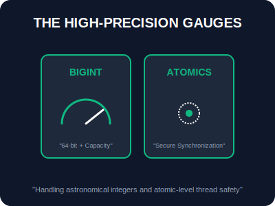

# SEC-01: BigInt & Atomics (The High-Precision Gauges)

> **"Beberapa beban kerja di Hub melampaui angka standar 64-bit, atau membutuhkan koordinasi sinkronisasi yang sangat ketat antar pekerja Grid. BigInt & Atomics adalah 'Meteran Presisi Tinggi' (High-Precision Gauges) untuk menangani data angka ekstrem dan menjaga ketertiban data di memori bersama."**

JavaScript modern menyediakan dua instrumen khusus untuk skenario performa tinggi: `BigInt` untuk akurasi matematis tanpa batas, dan `Atomics` untuk keamanan data pada lingkungan multi-thread.

---

## 1. Mental Model: "The High-Precision Gauges"

Bayangkan dua alat ukur canggih di ruang kontrol Hub:
- **BigInt (The Heavy Load Scale)**: Seperti timbangan raksasa yang tidak memiliki batas maksimal. Jika tipe data `Number` hanya sanggup menimbang hingga 9 kuadriliun, BigInt sanggup menimbang angka sebesar apapun selama memori Hub tersedia. Sangat penting untuk kriptografi dan ID transaksi finansial berskala galaksi.
- **Atomics (The Grid Coordinator)**: Seperti pengatur lalu lintas otomatis di persimpangan memori yang sibuk. Ia memastikan bahwa ketika banyak pekerja (Web Workers) mencoba mengakses kotak data yang sama (`SharedArrayBuffer`), mereka tidak akan merusak data tersebut. Operasi dilakukan secara "Atomik"—terjadi sepenuhnya atau tidak sama sekali.



---

## 2. Protokol Instrumen

### A. BigInt: Melewati Batas Aman
Gunakan akhiran `n` untuk mendefinisikan BigInt. Ingat: BigInt tidak bisa dicampur dengan Number biasa tanpa konversi.
```javascript
const maxSafe = BigInt(Number.MAX_SAFE_INTEGER); // 9007199254740991n
const hugeValue = maxSafe + 2n; // 9007199254740993n
```

### B. Atomics: Sinkronisasi Tanpa Celah
Atomics bekerja di atas `Int32Array` atau `Uint8Array` yang menggunakan `SharedArrayBuffer`.
```javascript
// Menambahkan 1 ke memori di index 0 secara aman (Atomik)
Atomics.add(typedArray, 0, 1); 
```

---

## 3. Fitur Utama Atomics
- **`load` / `store`**: Membaca dan menulis data dengan jaminan visibilitas antar thread.
- **`wait` / `notify`**: Mekanisme tidur dan bangun untuk koordinasi pekerja yang sangat efisien (rendah latensi).
- **Bitwise Atomics**: Melakukan operasi AND, OR, XOR langsung di memori bersama secara aman.

---

## Arsitek Mindset: Akurasi vs Performa

Sebagai arsitek Hub:
- **BigInt Overhead**: Gunakan BigInt hanya untuk data yang benar-benar membutuhkannya (seperti Bitwise 64-bit atau ID besar). Perhitungan BigInt lebih lambat daripada Number biasa karena tidak bisa dioptimalkan secara langsung oleh mesin JIT pada level perangkat keras.
- **Avoid Deadlocks**: Saat menggunakan `Atomics.wait()`, pastikan ada logika pengingat (`notify`) yang jelas agar pekerja tidak terjebak dalam tidur abadi.
- **Strict Typing**: Selalu ingat bahwa BigInt tidak mendukung operasi pecahan (Decimal). Gunakan ini hanya untuk bilangan bulat murni.

---

## Hands-on: Lab Instrumen Presisi
Uji kekuatan perhitungan angka raksasa dan simulasi koordinasi memori atomik di `examples/precision_tools_lab.js`.

---
*Status: [status.md](../../../status.md)*
