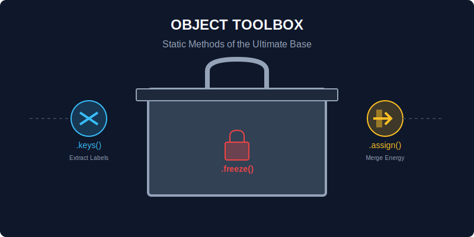

# CH-01: Object (The Ultimate Base)

> **"Objek adalah atom penyusun Hub Energi. Hampir semua yang Anda temui di JavaScript adalah objek atau setidaknya berperilaku seperti objek."**

Dalam bab ini, kita tidak membahas cara membuat objek biasa (itu ada di RAK-01), melainkan membahas kekuatan yang diberikan oleh global constructor `Object`.

## 1. Mental Model: "The Ultimate Base"

Bayangkan `Object` adalah cetak biru induk yang digunakan oleh seluruh peralatan di Hub Energi. Ia menyediakan "Toolbox" standar untuk memeriksa, memanipulasi, dan mengunci komponen energi.



---

## 2. Toolbox: Static Methods (Alat Inspeksi)

Global `Object` memiliki metode statis yang sangat kuat untuk mengelola data:

### A. Inspeksi (Melihat Isi)
- **`Object.keys(obj)`**: Mengambil semua nama kabel (properti).
- **`Object.values(obj)`**: Mengambil semua arus energi (nilai).
- **`Object.entries(obj)`**: Mengambil pasangan kabel dan arusnya dalam bentuk array.

```javascript
const hub = { id: "H1", power: "500MW" };
console.log(Object.keys(hub)); // ["id", "power"]
```

### B. Manipulasi & Duplikasi
- **`Object.assign(target, ...sources)`**: Menyalin energi dari satu modul ke modul lain.
- **`Object.entries()` & `Object.fromEntries()`**: Mengubah format data bolak-balik antara Objek dan Array.

---

## 3. Tool Pengunci (Keamanan)

Seperti yang kita pelajari di RAK-02, `Object` menyediakan alat untuk mengamankan sirkuit:
1.  **`Object.freeze(obj)`**: Kunci mati. Tidak ada perubahan sama sekali.
2.  **`Object.seal(obj)`**: Kunci pintu. Tidak bisa tambah/hapus, tapi isi (nilai) masih bisa diubah.

---

## Arsitek Mindset: Berpikir di Level Kunci-Nilai

Sebagai arsitek, gunakan `Object.entries()` jika Anda butuh melakukan pengulangan tingkat tinggi (seperti `map` atau `filter`) pada sebuah objek. Ubah objek menjadi array, proses, lalu kembalikan lagi menjadi objek menggunakan `Object.fromEntries()`. Ini memberikan fleksibilitas luar biasa tanpa merusak struktur asli Hub Anda.

---

## Hands-on: Lab Inspeksi Objek
Buka file `examples/object_toolbox.js` untuk mencoba alat-alat inspeksi statis pada berbagai jenis objek energi.

---
*Status: [status.md](../../../status.md)*
