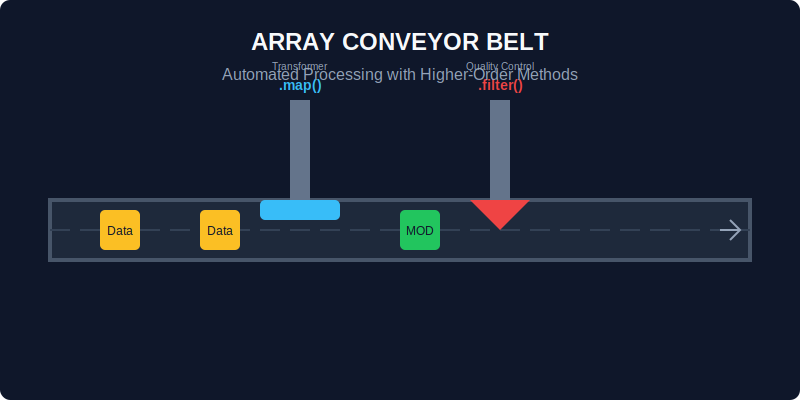

# CH-01: Array (Standard Conveyor)

> **"Array adalah ban berjalan universal yang mampu membawa beban apa pun, dari angka mentah hingga objek mesin yang kompleks, dalam urutan yang pasti."**

JavaScript `Array` bukan sekadar daftar statis, ia adalah objek dinamis dengan gudang metode bawaan yang sangat kaya.

## 1. Mental Model: "Standard Conveyor"

Bayangkan sebuah ban berjalan di Hub Energi. Anda bisa meletakkan barang di atasnya, mengambilnya dari ujung manapun, memotongnya di tengah, atau mengirimnya melalui robot pengolah (Iteration Methods).



---

## 2. Toolbox Statis (Alat pembuat ban)

- **`Array.isArray(obj)`**: Memeriksa apakah sebuah komponen benar-benar ban berjalan.
- **`Array.from(iterable)`**: Mengubah sekumpulan data acak (atau *NodeList*) menjadi ban berjalan yang bisa diproses.
- **`Array.of(vals...)`**: Membuat ban berjalan dengan muatan spesifik tanpa kebingungan sintaks `new Array()`.

---

## 3. Operasi Ban Berjalan (Iteration Methods)

Inilah kekuatan utama `Array` sebagai Higher-order Functions:

- **`.map()`**: Mengirim setiap muatan melalui robot transformator (menghasilkan ban berjalan baru).
- **`.filter()`**: Membuang muatan yang tidak memenuhi spesifikasi (menghasilkan ban berjalan baru yang lebih pendek).
- **`.reduce()`**: Mengumpulkan seluruh muatan menjadi satu unit energi terkonsolidasi.
- **`.forEach()`**: Robot yang melakukan tugas pada setiap muatan tanpa mengubah ban berjalan.

```javascript
const powerLevels = [10, 20, 30];
const totalPower = powerLevels.reduce((acc, current) => acc + current, 0); 
console.log(totalPower); // 60
```

---

## Arsitek Mindset: Memilih Metode yang Tepat

Sebagai arsitek, pilihlah metode yang paling deskriptif. Jika Anda ingin mengubah data, gunakan `.map()`. Jika ingin memvalidasi data, gunakan `.every()` atau `.some()`. Menghindari loop `for` tradisional demi metode deklaratif ini akan membuat sistem Hub Anda jauh lebih mudah dibaca dan dipelihara.

---

## Hands-on: Lab Ban Berjalan Otomatis
Buka file `examples/array_conveyor_lab.js` untuk mencoba berbagai kombinasi metode iterasi pada data energi Hub.

---
*Status: [status.md](../../../status.md)*
