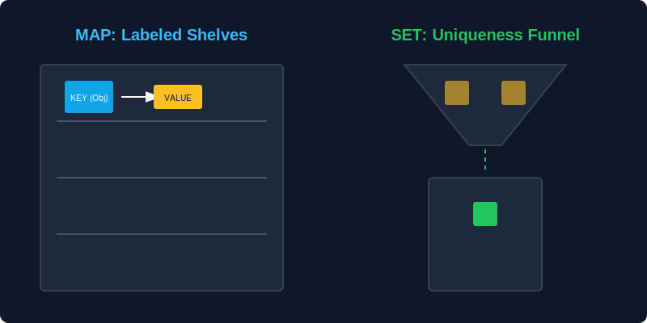

# CH-01: Map & WeakMap (Advanced Labels)

> **"Jika Objek adalah lemari penyimpanan sederhana, maka `Map` adalah sistem gudang logistik canggih yang memungkinkan Anda menempelkan label apa pun (bahkan modul fisik) pada barang Anda."**

`Map` adalah koleksi pasangan kunci-nilai yang jauh lebih kuat dan konsisten daripada objek biasa.

## 1. Mental Model: "Advanced Labels"

Dalam sebuah objek biasa, kunci (label) harus berupa teks atau symbol. Dalam sebuah `Map`, Anda bisa menggunakan **apa saja** sebagai kunci—mulai dari angka, objek, hingga fungsi.



---

## 2. Keunggulan `Map` vs `Object`

- **Sifat Kunci**: Bisa berupa objek atau tipe apa pun.
- **Urutan**: `Map` selalu mengingat urutan pemasukan elemen.
- **Ukuran**: Anda bisa langsung mengetahui jumlah barang dengan properti `.size`.
- **Iterasi**: `Map` didesain untuk diulang (*iterable*) secara langsung.

```javascript
const warehouse = new Map();
const engineMod = { type: "V8" };

warehouse.set(engineMod, "Active");
warehouse.set("ID-01", 500);

console.log(warehouse.get(engineMod)); // "Active"
console.log(warehouse.size);          // 2
```

---

## 3. WeakMap: Ephemeral Labels

`WeakMap` adalah varian khusus di mana kuncinya **harus berupa objek** dan hubungannya bersifat "lemah".

### Mental Model: "Ghost Labels"
Jika objek yang menjadi kunci di `WeakMap` sudah tidak lagi digunakan di tempat lain dalam Hub (dihapus), maka label di `WeakMap` juga akan hilang secara otomatis oleh Garbage Collector. Ini mencegah kebocoran memori di gudang logistik Anda.

---

## Arsitek Mindset: Kapan Menggunakan Map?

Pilihlah **Map** jika Anda butuh:
1.  Kunci yang bukan berupa string (misal: memetakan meta-data ke sebuah objek DOM atau mesin).
2.  Mengetahui jumlah elemen secara tepat dan sering.
3.  Urutan pemasukan elemen yang konsisten saat melakukan pengulangan.

---

## Hands-on: Lab Logistik Canggih
Buka file `examples/map_warehouse_lab.js` untuk melihat bagaimana kita mengelola meta-data mesin menggunakan `Map` dan bagaimana `WeakMap` membantu menjaga kebersihan memori.

---
*Status: [status.md](../../../status.md)*
