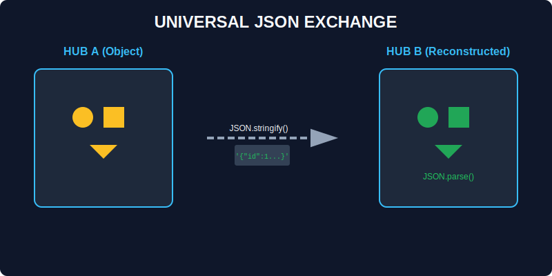

# CH-03: JSON (Universal Exchange)

> **"Saat Hub Energi Anda perlu mengirim data ke Hub lain (seperti server atau database), ia harus mengubah objek internalnya menjadi bahasa universal yang dipahami semua sistem. Inilah peran `JSON`—penerjemah data lintas platform."**

`JSON` (JavaScript Object Notation) adalah format pertukaran data yang ringan dan didukung oleh hampir semua bahasa pemrograman modern.

## 1. Mental Model: "Universal Exchange"

Bayangkan Anda memiliki mesin yang kompleks di Hub Energi. Untuk mengirimnya melalui jalur transmisi yang sempit, Anda harus "membongkar" mesin tersebut menjadi petunjuk perakitan teks sederhana (Serialization). Hub penerima kemudian akan "merakitnya" kembali menjadi objek mesin yang fungsional (Deserialization).



---

## 2. Mengemas Data (Stringify)

Metode **`JSON.stringify(obj)`** mengubah objek JavaScript menjadi string JSON.

### Fitur Lanjut:
- **Replacer**: Memilih kabel mana saja yang ingin dikirim.
- **Space**: Menambah spasi agar teks instruksi lebih mudah dibaca manusia (*pretty-print*).

```javascript
const hubData = { id: 1, status: "active", secret: "123" };
const message = JSON.stringify(hubData, ["id", "status"], 2);
/* Hasil:
{
  "id": 1,
  "status": "active"
}
*/
```

---

## 3. Membuka Kemasan (Parse)

Metode **`JSON.parse(text)`** mengambil string JSON dan merakitnya kembali menjadi objek JavaScript.

### Fitur Lanjut:
- **Reviver**: Melakukan pemeriksaan atau transformasi instan saat barang sedang dirakit kembali (misal: mengubah string tanggal menjadi objek `Date`).

---

## Arsitek Mindset: Batas-batas Terjemahan

Sebagai arsitek, Anda harus tahu bahwa tidak semua komponen Hub bisa diterjemahkan ke JSON:
1.  **Function**: Akan hilang saat dikemas.
2.  **Symbol**: Akan diabaikan.
3.  **BigInt**: Akan menyebabkan error jika tidak dikonversi terlebih dahulu.
4.  **Undefined**: Akan hilang dari objek.

**Solusi**: Jika Anda perlu mengirim data kompleks, pastikan Anda melakukan *pre-processing* (seperti mengubah BigInt menjadi String) sebelum memanggil `JSON.stringify`.

---

## Hands-on: Lab Transmisi Universal
Buka file `examples/json_exchange_lab.js` untuk mencoba teknik pengemasan data tingkat lanjut menggunakan replacer dan reviver.

---
*Status: [status.md](../../../status.md)*
