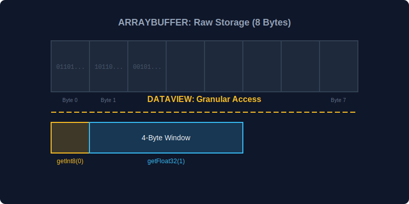

# CH-01: ArrayBuffer & DataView (Memory Access)

> **"Di lapisan terbawah Hub Energi, data bukan lagi teks atau angka objek, melainkan deretan bit mentah dalam memori. `ArrayBuffer` adalah wadahnya, dan `DataView` adalah mikroskop canggih untuk membaca data tersebut dengan presisi ekstrem."**

Bab ini membahas cara JavaScript menangani memori mentah secara terstruktur.

## 1. Mental Model: "Memory Access"

Bayangkan `ArrayBuffer` adalah sebuah kaset kosong berukuran tetap. Anda tidak bisa mendengar lagu dari kaset itu secara langsung. Anda butuh "Player" (View) untuk membacanya. `DataView` adalah player paling fleksibel yang bisa membaca data dalam format apa pun (8-bit, 16-bit, 32-bit) dari posisi mana pun pada kaset tersebut.



---

## 2. ArrayBuffer: Wadah Memori Mentah

`ArrayBuffer` hanya mengalokasikan memori. Ia tidak tahu apa isinya.
```javascript
// Mengalokasikan 8 byte memori mentah
const storage = new ArrayBuffer(8); 
console.log(storage.byteLength); // 8
```

---

## 3. DataView: Mikroskop Granular

Berbeda dengan `TypedArray` yang mengunci satu tipe data untuk seluruh buffer, `DataView` memungkinkan Anda membaca data dengan tipe yang berbeda-beda dalam satu buffer yang sama.

### Fitur Utama:
- **`get` / `set` methods**: `getInt8`, `getUint16`, `getFloat32`, dll.
- **Endianness**: Anda bisa memilih untuk membaca data dari depan (*Big-Endian*) atau belakang (*Little-Endian*). Ini sangat krusial saat berkomunikasi dengan perangkat keras yang berbeda.

```javascript
const view = new DataView(storage);

// Menulis 100 sebagai Int8 di byte ke-0
view.setInt8(0, 100);

// Menulis 1234.56 sebagai Float32 di byte ke-1
view.setFloat32(1, 1234.56);

console.log(view.getInt8(0));    // 100
console.log(view.getFloat32(1)); // 1234.56
```

---

## Arsitek Mindset: Presisi Binary

Sebagai arsitek, gunakan `DataView` saat Anda harus mengikuti protokol biner yang sangat ketat (seperti format file kustom atau protokol jaringan bit-by-bit). Jika Anda hanya butuh ban berjalan angka yang homogen, gunakanlah **TypedArrays** (seperti yang dibahas di RAK-03 SR-02) karena sintaksnya lebih sederhana dan performanya lebih optimal untuk data seragam.

---

## Hands-on: Lab Mikroskop Memori
Buka file `examples/dataview_microscope_lab.js` untuk mencoba membaca satu buffer memori yang sama menggunakan berbagai jenis `get` methods dan memahami perbedaan *Little-Endian* vs *Big-Endian*.

---
*Status: [status.md](../../../status.md)*
