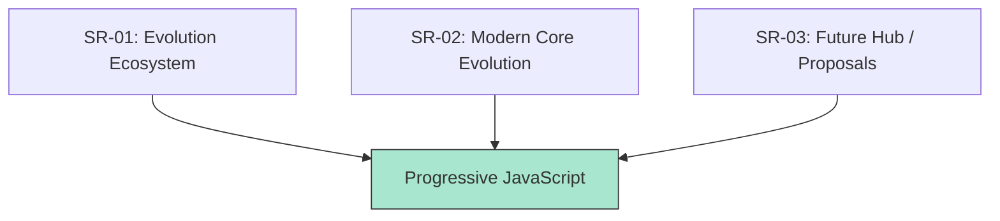

# RAK-03: Evolution & ESNext (The Progress)

> **"Sirkuit yang terus bermutasi. `RAK-03` membedah ekosistem evolusi JavaScript, dari tata kelola TC39 hingga proposal dan fitur modern yang membentuk masa depan bahasa."**

---

## Evolution Hub Architecture

---

## Sub-Rack Collection

### 1. [SR-01: Evolution Ecosystem](./SR-01-evolution-ecosystem/)
Membedah bagaimana standar bergerak: tata kelola TC39, konsensus komite, dan lifecycle proposal dari ide hingga spesifikasi resmi.

### 2. [SR-02: Modern Core Evolution](./SR-02-modern-core-evolution/)
Membedah apa yang berubah di inti bahasa modern: struktur, async flow, ketahanan data, metaprogramming, dan arsip gelombang fitur tahunan.

### 3. [SR-03: Future Hub / Proposals](./SR-03-future-hub-proposals/)
Membedah apa yang akan datang: proposal aktif, kesiapan fitur masa depan, dan timeline rilis tahunan ECMAScript.

---

## Architectural Goal

`RAK-03` bukan sekadar daftar fitur. Rak ini berfungsi sebagai jembatan evolusi antara **RAK-02 (Foundation)** dan **RAK-04 (Core Specification)**, memberi konteks mengapa sebuah fitur lahir, bagaimana ia matang, dan kapan ia menjadi bagian stabil dari bahasa.

---
*Status: [x] Complete (3 Sub-Racks).*
