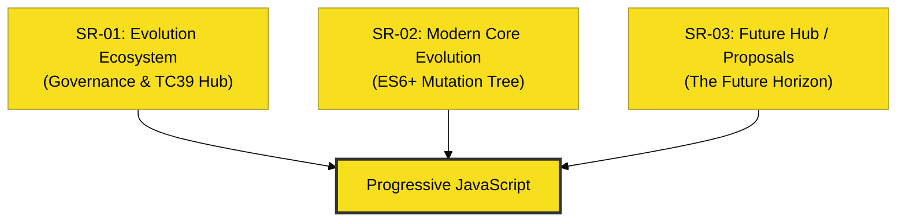

# RAK-03: Evolution & ESNext (The Progress)

> **"Sirkuit yang terus bermutasi. `RAK-03` membedah ekosistem evolusi JavaScript, dari tata kelola TC39 hingga mutasi fitur modern yang membentuk masa depan bahasa."**

---

## Evolution Hub Architecture

---

## Sub-Rack Collection

### 1. [SR-01: Evolution Ecosystem](./SR-01-evolution-ecosystem/)
Membedah bagaimana standar bergerak: **TC39 Governance Hub** dan **Standardization Pipeline** dari ide hingga spesifikasi resmi.

### 2. [SR-02: Modern Core Evolution](./SR-02-modern-core-evolution/)
Membedah mutasi inti bahasa modern: **Structural Mutation**, **Logical Flow (Async/Meta)**, dan **Data Resilience Hub**.

### 3. [SR-03: Future Hub / Proposals](./SR-03-future-hub-proposals/)
Membedah cakrawala masa depan: **Active Proposals (Stage 1-3)** dan **Annual Release Timeline** tahunan.

---

## Architectural Goal

`RAK-03` bukan sekadar daftar fitur. Rak ini berfungsi sebagai jembatan evolusi antara **RAK-02 (Foundation)** dan **RAK-04 (Core Specification)**, memberi konteks mengapa sebuah fitur lahir, bagaimana ia matang, dan kapan ia menjadi bagian stabil dari sirkuit bahasa secara kinetik.

---
*Status: [x] Complete (All Hubs Reconstructed).*
