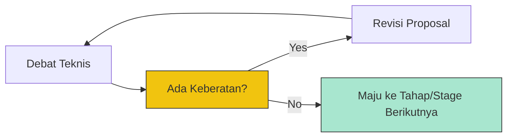

# CH-02: Consensus and Decision Making

> **"Aturan konsensus mutlak. `Consensus and Decision Making` adalah protokol unik TC39 yang memastikan tidak ada satu pihak pun yang bisa memaksakan kehendak."**

**Source Hub**: 
- [TC39 Meeting Notes](https://github.com/tc39/notes)

---

## 1. Konsep & Esensi

**Definisi Arsitek**:
Proses pengambilan keputusan di TC39 didasarkan pada **Consensus** (bukan voting mayoritas). Konsensus berarti "tidak ada keberatan yang kuat" dari delegasi yang hadir. Jika satu perusahaan besar merasa sebuah fitur akan merusak browser mereka, fitur tersebut tidak akan maju ke tahap berikutnya sampai masalah terselesaikan.

**Model Mental**:
Jika 5 teknisi sedang merancang sirkuit baru, mereka tidak melakukan voting 3 lawan 2. Mereka berdiskusi sampai ke-5 teknisi tersebut setuju bahwa sirkuit ini aman untuk dipasang (Zero Objection).

---

## 2. Visualisasi Sistem: Decision Flow

---

## 3. Mekanisme & Hubungan

### Protokol Rapat
1. **Plenary Sessions**: Rapat besar 3 hari setiap dua bulan sekali.
2. **Championiing**: Setiap proposal harus memiliki "Champion" (pembela) yang mengawal proposal tersebut melalui perdebatan teknis.
3. **Consensus Requirement**: Tanpa konsensus, sebuah fitur bisa tertahan di Stage 2 selama bertahun-tahun.

### Arsitek Mindset: Designing for Decades
- TC39 beroperasi dengan prinsip "Don't Break the Web". Keputusan yang diambil hari ini harus tetap bekerja dengan kode yang ditulis 20 tahun lalu. Inilah alasan mengapa mereka sangat berhati-hati dalam menambah sintaksis baru ke dalam Hub.

---

## 4. Lab Praktis
Bacalah salah satu "Meeting Notes" dari repositori TC39 untuk merasakan ketegangan dan kedalaman teknis saat para delegasi berdebat tentang sebuah fitur kecil.

---
*Status: [x] Complete.*
