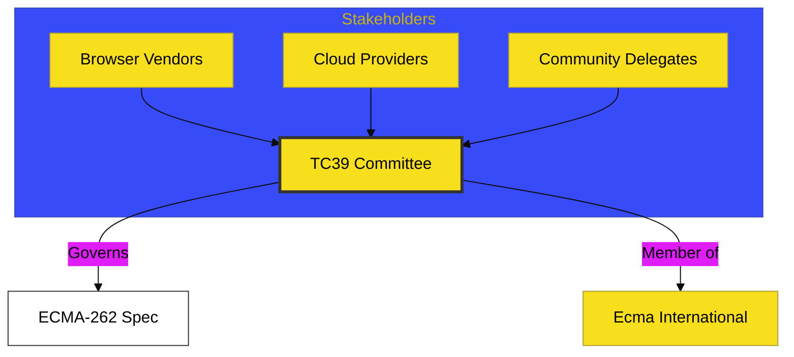

# BK-01: Governance Hub

> **"Pusat Tata Kelola: Membedah Komite dan Arsitektur Standarisasi JavaScript Global."**

---

## 🔗 Source Hub
- **Primary Source**: [TC39 - Ecma International](https://www.ecma-international.org/technical-committees/tc39/)
- **Technical Reference**: [TC39 Governance](https://github.com/tc39/how-we-work)
- **Conceptual Parent**: [RAK-03 Evolution](../README.md)

---

## 🌓 1. Essence: The Logic
JavaScript tidak tumbuh secara acak; ia digerakkan oleh konsensus para ahli. Di **BK-01**, kita membedah **TC39** (*Technical Committee 39*) sebagai otoritas tunggal yang menjaga integritas spesifikasi ECMAScript. Memahami tata kelola ini sangat krusial bagi arsitek Hub untuk mengetahui bagaimana sebuah fitur bisa lahir, siapa yang mengakuinya, dan mengapa sebuah standar bisa bertahan puluhan tahun.

Di sini, kita melihat JavaScript sebagai entitas yang hidup melalui kontribusi kolaboratif dari berbagai pemangku kepentingan industri (browser vendors, cloud providers, & community delegates).

---

## 🎨 2. Visual Logic: The Committee Ecosystem
Mekanisme interaksi dan keterhubungan di dalam ekosistem tata kelola standar:

---

## 🏛️ 3. Sections Atlas
- **[CH-01: Governance Overview](./CH-01_GovernanceOverview/)**: Membedah fondasi filosofis dan aturan main standarisasi ECMA.
- **[CH-02: Members](./CH-02_Members/)**: Meninjau peran delegasi, kontributor, dan organisasi yang memiliki hak suara di komite.
- **[CH-03: Decision Making](./CH-03_DecisionMaking/)**: Menjelaskan proses konsensus dan bagaimana "Veto" bekerja di dalam sidang TC39.

---

## 🧪 4. The Lab (Policy Lab)
Pelajari dokumen kebijakan dan catatan pertemuan (*Meeting Notes*) resmi di:
- `https://github.com/tc39/notes`

---

## ⚠️ 5. Common Pitfalls & Myths
- **Mitos**: *"Google atau Microsoft memiliki JavaScript secara penuh."* (Salah, JavaScript dimiliki oleh **Ecma International**; vendor browser hanyalah anggota dari komite TC39 yang bekerja berdasarkan konsensus bersama).
- **Mitos**: *"Siapa pun bisa langsung mengubah standar JavaScript."* (Faktanya, perubahan harus melalui proses proposal yang ketat dan membutuhkan sponsor dari delegasi resmi TC39 sebelum bisa masuk ke dalam draft spesifikasi).

---
*Back to [Evolution Ecosystem](../README.md)*
