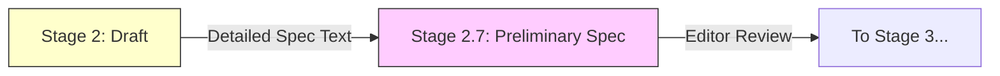

# CH-02: Specification Stage (Drafting the Rigor)

> **"The Blueprint of Reality: Defining the Technical Spec"**

**Source Hub**: 
- [TC39 Process Document](https://tc39.es/process-document/)
- [ECMA-262 Specification Draft](https://tc39.es/ecma262/)

---

## 1. Konsep & Esensi

**Definisi Arsitek**:
Di fase ini, proposal mulai ditulis dalam bahasa spesifikasi formal (**Ecmarkup**). **Stage 2** menandakan bahwa desain awal sudah stabil, dan komite mengharapkan fitur ini akan benar-benar masuk ke bahasa (Standard Intent).

**Model Mental**:
Bayangkan sketsa kasar gedung tadi kini diubah menjadi cetak biru (blueprint) teknis yang sangat detail (Stage 2). Di sini kita sudah tahu jenis beton apa yang dipakai, tinggi presisi setiap tiang, dan bagaimana pipa air terintegrasi.

---

## 2. Visualisasi Sistem: Rigoritas Spec

---

## 3. Mekanisme & Hubungan

### Stage 2: Draft
- **Status**: Versi pertama dari teks spesifikasi formal.
- **Kriteria**: Harus menggunakan format **Ecmarkup** (bahasa yang digunakan ECMA-262).
- **Tujuan**: Menyelesaikan semua masalah desain yang besar.

### Stage 2.7: Preliminary Spec (Baru per 2023/2024)
- **Status**: Tahap transisi untuk memastikan teks spesifikasi sudah sangat matang sebelum implementasi engine.
- **Tujuan**: Mengurangi revisi besar di Stage 3 yang bisa menghambat pembuat engine.

---

## 4. Lab Praktis
Unit ini bersifat teoritis-spesifikasi. Pembuktian algoritma teks spesifikasi dapat dipelajari lebih lanjut di [RAK-04-core-specification](../../../../RAK-04-core-specification/).

---
*Status: [x] Complete.*
