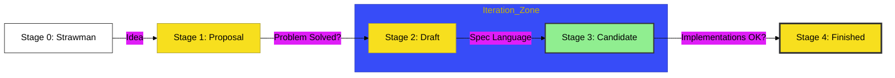

# BK-02: TC39 Process

> **"Siklus Hidup Standar: Membedah Jalur Evolusi dari Ide Atomik hingga Spesifikasi Resmi."**

---

## 🔗 Source Hub
- **Primary Source**: [TC39 - The Process](https://tc39.es/process-document/)
- **Technical Reference**: [TC39 Github - Proposals](https://github.com/tc39/proposals)
- **Conceptual Parent**: [RAK-03 Evolution](../README.md)

---

## 🌓 1. Essence: The Logic
Setiap sintaks baru yang Anda gunakan (seperti *Optional Chaining* atau *Async/Await*) harus melewati "Sirkuit Seleksi" yang ketat. Di **BK-02**, kita membedah mekanisme internal penapisan ide melalui **TC39 Stage Process**. Memahami siklus ini memungkinkan Anda memprediksi kapan sebuah fitur akan siap digunakan di lingkungan produksi dan tingkat stabilitasnya.

Ini bukan sekadar aturan birokrasi; ini adalah filter kualitas yang menjamin JavaScript tetap memiliki performa tinggi dan interoperabilitas lintas perangkat tanpa merusak web yang sudah ada (*Don't break the web*).

---

## 🎨 2. Visual Logic: The TC39 Pipeline
Mekanisme pengolahan proposal melalui 5 tahap seleksi (0 - 4):

---

## 🏛️ 3. Sections Atlas
- **[CH-01: Lifecycle Overview](./CH-01_LifecycleOverview/)**: Membedah teknik dasar pengajuan proposal dan kriteria awal.
- **[CH-02: Incubation Stage](./CH-02_IncubationStage/)**: Meninjau perjalanan dari Stage 1 (Eksperimen) ke Stage 2 (Draft Formal).
- **[CH-03: Specification Stage](./CH-03_SpecificationStage/)**: Menjelaskan penyelesaian bahasa spesifikasi di Stage 3.
- **[CH-04: Completion Stage](./CH-04_CompletionStage/)**: Meninjau proses rilis tahunan dan penggabungan fitur ke standar utama di Stage 4.

---

## 🧪 4. The Lab (Process Lab)
Pantau status proposal aktif secara real-time di laboratorium resmi:
- `https://tc39.es/proposals/`

---

## ⚠️ 5. Common Pitfalls & Myths
- **Mitos**: *"Fitur di Stage 3 sudah bisa digunakan sepenuhnya di produksi."* (Sangat berbahaya; arsitek Hub harus waspada bahwa Stage 3 adalah **Candidate**. Meskipun sudah stabil, masih mungkin ada perubahan kritis sebelum masuk ke Stage 4. Gunakan fitur Stage 3 dengan transpilasi (Babel) yang tepat).
- **Mitos**: *"Komite memutuskan fitur berdasarkan tren populer."* (Faktanya, keputusan didasarkan pada keberterimaan teknis, kegunaan nyata, dan keselarasan dengan memori serta engine JavaScript, bukan sekadar popularitas sintaks).

---
*Back to [Evolution Ecosystem](../README.md)*
