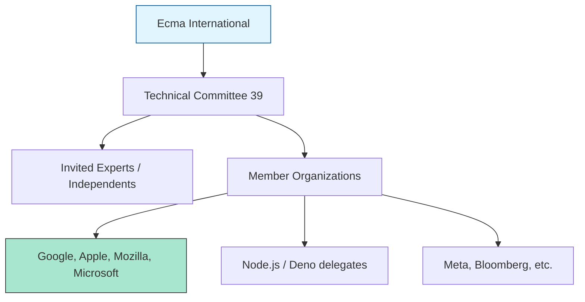

# CH-01: Members and Delegates

> **"Siapa yang mengendalikan masa depan Hub? `Members and Delegates` menjelaskan komposisi dewan yang bertanggung jawab atas evolusi bahasa."**

**Source Hub**: 
- [TC39 Members List](https://www.ecma-international.org/technical-committees/tc39/?tab=membership)

---

## 1. Konsep & Esensi

**Definisi Arsitek**:
**TC39** adalah komite teknis di bawah Ecma International yang bertugas menstandarisasi bahasa ECMAScript. Komite ini terdiri dari delegasi dari berbagai perusahaan teknologi besar (Browser vendors seperti Google, Apple, Mozilla, Microsoft; hingga perusahaan Cloud seperti Cloudflare dan Meta).

**Model Mental**:
Bayangkan Hub sebagai sebuah gedung apartemen internasional. **Delegates** adalah perwakilan dari setiap unit (Perusahaan) yang berkumpul di ruang rapat setiap beberapa bulan untuk memutuskan warna cat baru atau perbaikan lift (Standar Bahasa).

---

## 2. Visualisasi Sistem: TC39 Membership Structure

---

## 3. Mekanisme & Hubungan

### Peran dan Tanggung Jawab
1. **Delegates**: Orang yang secara aktif menghadiri pertemuan dan memberikan suara atau masukan teknis.
2. **Chair**: Pemimpin rapat yang memastikan diskusi berjalan sesuai jadwal dan mencapai kesimpulan.
3. **Editor Group**: Tim yang bertanggung jawab menulis teks spesifikasi formal (ECMA-262) berdasarkan keputusan komite.

### Arsitek Mindset: Distributed Power
- JavaScript tidak dimiliki oleh satu individu atau perusahaan. Ini adalah arsitektur yang sangat demokratis namun lambat karena membutuhkan persetujuan dari banyak pihak yang berkompetisi. Hal ini menjamin bahwa setiap fitur yang "lolos" telah diuji secara ekstrem untuk kompatibilitas web global.

---

## 4. Lab Praktis
Kunjungi repositori [github.com/tc39/proposals](https://github.com/tc39/proposals) untuk melihat daftar delegasi yang sedang menjadi "Champions" untuk fitur-fitur baru.

---
*Status: [status.md](../../../../../status.md)*
