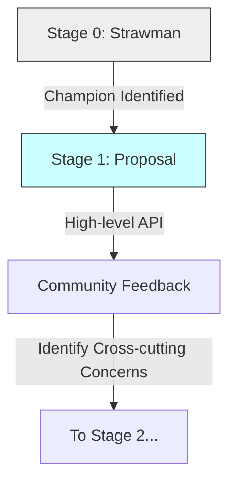

# CH-01: Incubation Stage (Strawman to Proposal)

> **"The Seed of Innovation: Proposing the Next Evolution"**

**Source Hub**: 
- [TC39 Process Document](https://tc39.es/process-document/)
- [Active Proposals](https://github.com/tc39/proposals)

---

## 1. Konsep & Esensi

**Definisi Arsitek**:
Fase inkubasi adalah tahap di mana sebuah ide liar (Strawman) mulai diformalkan menjadi proposal teknis yang teridentifikasi. **Stage 1** adalah pengakuan resmi dari komite bahwa ide tersebut layak untuk dieksplorasi lebih lanjut.

**Model Mental**:
Bayangkan sebuah kotak saran di sebuah gedung pemerintah (Stage 0). Jika ada seseorang (Champion) yang mengambil saran tersebut, melengkapinya dengan sketsa kasar, dan mempresentasikannya di depan dewan, maka ia masuk ke **Stage 1**.

---

## 2. Visualisasi Sistem: Alur Inkubasi

---

## 3. Mekanisme & Hubungan

### Stage 0: Strawman
- **Status**: Ide awal yang belum diformalkan.
- **Kriteria**: Harus dipresentasikan oleh anggota TC39 atau kontributor terdaftar.
- **Tujuan**: Untuk membuka diskusi tentang problem space.

### Stage 1: Proposal
- **Status**: Proposal resmi untuk memecahkan masalah.
- **Kriteria**:
  1. Harus ada **Champion** (anggota TC39).
  2. Harus mendefinisikan **Problem Space** yang jelas.
  3. Harus menyertakan contoh penggunaan (**Examples**) dan API awal.
  4. Harus mengidentifikasi tantangan teknis (Cross-cutting concerns).
- **Tujuan**: Komite setuju untuk meluangkan waktu meninjau solusi ini.

---

## 4. Lab Praktis
Unit ini tidak membutuhkan Lab Praktis kode karena bersifat kebijakan fundamental. Anda dapat melihat daftar proposal Stage 1 aktif di [TC39 Proposals Repo](https://github.com/tc39/proposals).

---
*Status: [status.md](../../../../../status.md)*
