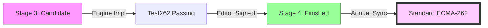

# CH-03: Completion Stage (Candidate to Finished)

> **"The Final Ascent: Landing in the Specification Hub"**

**Source Hub**: 
- [TC39 Process Document](https://tc39.es/process-document/)
- [ECMA-262 Status](https://github.com/tc39/proposals/blob/main/finished-proposals.md)

---

## 1. Konsep & Esensi

**Definisi Arsitek**:
Tahap penyelesaian adalah fase di mana proposal fitur telah melewati rigoritas teoritis dan memasuki pembuktian praktis. **Stage 3** menandakan bahwa desain sudah matang dan siap untuk implementasi engine, sementara **Stage 4** adalah tanda bahwa fitur tersebut telah menjadi bagian permanen dari bahasa.

**Model Mental**:
Bayangkan sebuah gedung yang sudah selesai desain arsitekturnya (Stage 2). Di **Stage 3**, kontraktor (pembuat engine) mulai membangunnya. Jika gedung tersebut terbukti kokoh dan fungsional setelah dihuni sebentar, maka ia akan mendapatkan Sertifikat Layak Huni (Stage 4).

---

## 2. Visualisasi Sistem: Alur Finalisasi

---

## 3. Mekanisme & Hubungan

### Kriteria Stage 3 (Candidate)
Di tahap ini, proposal sudah dianggap **Hampir Selesai**. Tidak ada lagi revisi desain kecuali ditemukan bug fatal saat implementasi.
- **Spec Text**: Harus sudah lengkap (100% ECMA-262 compatibility).
- **Design Sign-off**: Komite setuju bahwa tidak ada masalah desain yang tersisa.
- **Implementer Intent**: Setidaknya ada satu engine yang menyatakan minat serius untuk mulai mengimplementasikannya.

### Kriteria Stage 4 (Finished)
Untuk mencapai garis finish, proposal harus memiliki:
1. **Dua Implementasi Independen**: Minimal 2 engine (misal: V8 dan SpiderMonkey) yang sudah mengimplementasikan fitur tersebut secara penuh.
2. **Test262**: Semua test case di suite pengujian standar ECMAScript harus lulus.
3. **Pull Request**: Teks spesifikasi sudah di-merge ke draf utama ECMA-262.

---

## 4. Lab Praktis
Unit ini tidak membutuhkan Lab Praktis kode khusus karena bersifat penjelasan proses standarisasi. Dokumentasi kriteria rilis dapat dilihat di folder `docs/`.

---
*Status: [status.md](../../../../../status.md)*
