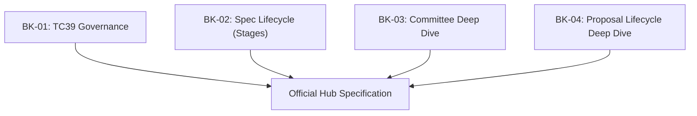

# SR-01: Evolution Ecosystem (The Stewardship)

> **"Mekanisme Kemajuan Hub. `SR-01` membedah bagaimana standar bermanuver, siapa yang memegang kendali, dan bagaimana sebuah ide bertransformasi menjadi spesifikasi resmi."**

**Source Hub**:
- [TC39: About](https://tc39.es/about/)
- [ECMA-262: Introduction](https://tc39.es/ecma262/#sec-introduction)

---

## The Stewardship Pillars

---

## Koleksi Buku:
1. **[BK-01: TC39 Governance](./BK-01_Governance/)**: Peta konsep dan sintesis tata kelola TC39.
2. **[BK-02: Spec Lifecycle](./BK-02_SpecLifecycle/)**: Ringkasan mekanisme Stage 0-4 sebagai model besar.
3. **[BK-03: Committee](./BK-03_Committee/)**: Deep dive chapter-level untuk anggota, delegasi, dan konsensus.
4. **[BK-04: Proposal Lifecycle](./BK-04_ProposalLifecycle/)**: Deep dive chapter-level untuk perjalanan proposal dari inkubasi hingga Stage 4.

### Boundary

- `BK-01` dan `BK-02` berperan sebagai buku payung konseptual.
- `BK-03` dan `BK-04` berperan sebagai ekspansi detail, bukan pengganti dua buku payung di atas.

---
*Back to [RAK-03](../README.md)*
