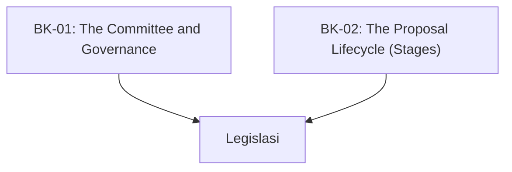

# SR-01: TC39 Process (The Legislative Engine)

> **"Mekanisme Legislatif di Balik Evolusi JavaScript. SR-01 membedah 'Proses TC39'—bagaimana sebuah ide berkembang dari diskusi santai menjadi standar global."**

**Source Hub**: 
- [TC39 Process Document](https://tc39.es/process-document/)
- [ECMA-262: Intro](https://tc39.es/ecma262/#sec-intro)

---

## 🏗️ The 2 Pillars of Legislative Architecture

---

## Koleksi Buku:
1.  **[BK-01: The Committee and Governance](./BK-01_Committee/)**: Mengenal anggota TC39, sistem konsensus, dan ritme pertemuan.
2.  **[BK-02: The Proposal Lifecycle](./BK-02_FiveStages/)**: Dekonstruksi Stage 0 hingga Stage 4 dari sebuah proposal fitur.

---
*Status: [status.md](../../status.md) | Back to [RAK-03](../README.md)*
