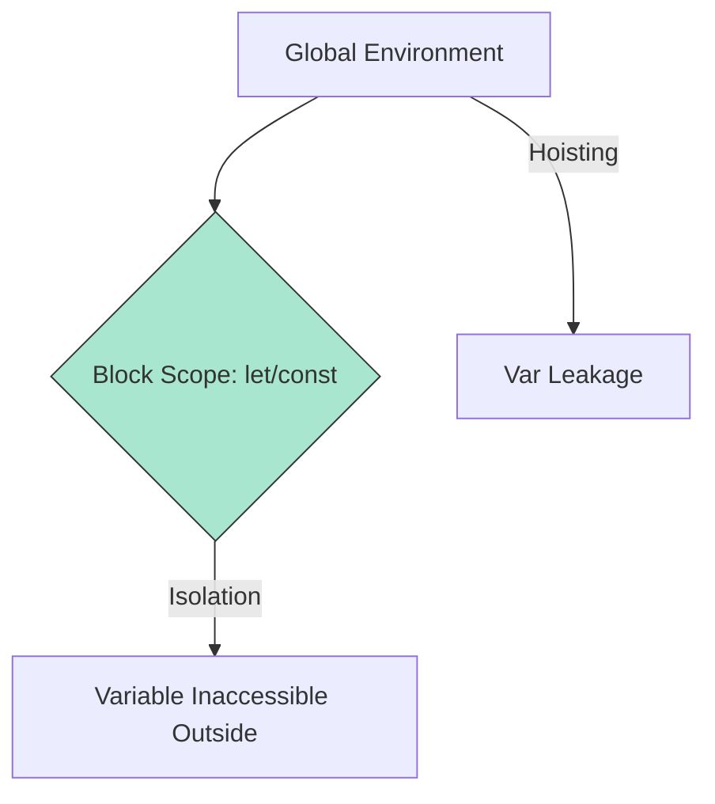

# CH-01: Lexical Structures (Structural & Lexical Reinforcement)

> **"Penguatan Kerangka Hub. `Lexical Structures` membedah transisi dari pola lama menuju arsitektur modern yang lebih aman, terisolasi, dan terstruktur."**

**Source Hub**:
- [ECMA-262: Class Definitions](https://tc39.es/ecma262/#sec-class-definitions)
- [ECMA-262: Block-Level Scoping](https://tc39.es/ecma262/#sec-let-and-const-declarations)

---

## 1. Konsep & Esensi

**Definisi Arsitek**:
ES2015 memperkenalkan **Lexical Scoping** yang ketat melalui `let` dan `const`, serta **Class Sugar** yang menstandarisasi pembuatan objek. Ini bukan sekadar penambahan fitur, tetapi perbaikan sirkuit agar tidak terjadi kebocoran variabel yang tidak terprediksi.

**Model Mental**:
- **Lexical Scope**: Seperti ruang kontrol tertutup yang hanya bisa diakses dari zona bloknya sendiri.
- **Class Syntax**: Seperti panel arsitektur modern yang merapikan kabel prototipe lama tanpa mengganti mesin di baliknya.

---

## 2. Visualisasi Sistem: Lexical vs Global Scope

---

## 3. Mekanisme & Hubungan

### Infrastruktur Struktural
1. **Lexical Declarations**: `let` dan `const` menciptakan Environment Record baru yang terbatas pada blok `{}`.
2. **Class Mechanics**: Class tetap berjalan di atas prototype chain; ia adalah notasi yang lebih rapi, bukan model objek baru.
3. **Module System**: Menstandarisasi transmisi energi antar file tanpa bergantung pada variabel global.

---

## 4. Arsitek Mindset
Gunakan `const` sebagai default. Gunakan `let` hanya jika sirkuit memang butuh mutasi. Hindari `var` karena perilaku kebocorannya bertentangan dengan arsitektur modern.

---

## 5. Lab Praktis
1. **[Lexical Isolation](./examples/01_lexical_isolation.js)**: Demonstrasi perbedaan antara kebocoran `var` dan isolasi `let/const`.
2. **[Class Anatomy](./examples/02_class_anatomy.js)**: Membedah hubungan antara sintaks class dan mekanisme prototipe di bawahnya.

---
*Status: [x] Complete.*
