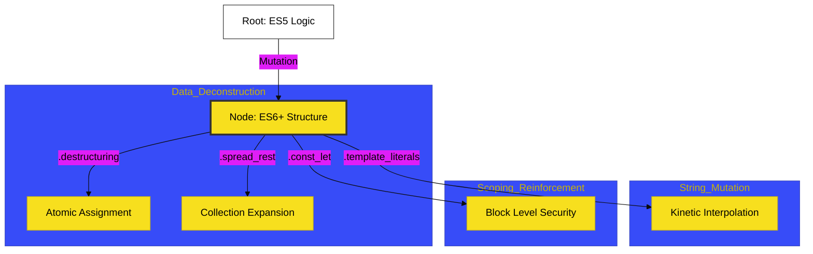

# BK-01: Structural & Lexical Mutation

> **"Mutasi Struktur: Mengatur Ulang Anatomi Bahasa Melalui Dekonstruksi dan Penguatan Sintaksis."**

---

## 🔗 Source Hub
- **Primary Source**: [MDN Web Docs - ES6 Features](https://developer.mozilla.org/en-US/docs/Web/JavaScript/New_in_JavaScript/ECMAScript_Next_support_in_Mozilla)
- **Technical Reference**: [ECMA-262 - Lexical Grammar](https://tc39.es/ecma262/#sec-ecmascript-language-lexical-grammar)
- **Conceptual Parent**: [RAK-03 Evolution](../README.md)

---

## 🌓 1. Essence: The Logic
Struktur adalah fondasi dari setiap instruksi. Di **BK-01**, kita membedah mekanisme internal bagaimana JavaScript modern meninggalkan batasan ES5 untuk mengadopsi struktur yang lebih ringkas dan ekspresif. Memahami **Structural Mutation** bukan sekadar belajar "sintaks baru"; ini adalah tentang memahami perpindahan paradigma menuju **Dekonstruksi Data** dan **Penguatan Scoping** yang mencegah kebocoran sirkuit memori.

Di sini, kita melihat bagaimana fitur seperti *Spread Operator* dan *Template Literals* bukan hanya "pemanis", melainkan hasil evolusi dari kebutuhan akan manipulasi data yang lebih presisi dan atomik.

---

## 🎨 2. Visual Logic: The Structural Mutation Tree
Peta evolusi dari akar ES5 menuju mutasi struktur modern:

---

## 🏛️ 3. Sections Atlas
- **[CH-01: Lexical Structures](./CH-01_LexicalStructures/)**: Membedah teknik penguatan variabel (`let`/`const`) dan evolusi aturan scoping.
- **[CH-02: Top Level Await](./CH-02_TopLevelAwait/)**: Meninjau pembersihan alur asinkron di level modul teratas.
- **[CH-03: Class Private Static](./CH-03_ClassPrivateStatic/)**: Menjelaskan mutasi struktur kelas melalui enkapsulasi absolut.

---

## 🧪 4. The Lab (Structural Lab)
Uji ketajaman manipulasi struktur data modern di laboratorium:
- `../examples/destructuring_spread_demo.js`

---

## ⚠️ 5. Common Pitfalls & Myths
- **Mitos**: *"Destructuring hanyalah singkatan untuk menulis kode lebih cepat."* (Salah, **Destructuring** adalah mekanisme ekstraksi data atomik yang aman. Kegagalan memahami pola dekonstruksi bisa menyebabkan sirkuit mati jika Anda tidak menyediakan nilai default pada data yang mungkin `undefined`).
- **Mitos**: *"Spread operator menyalin objek secara mandiri sepenuhnya."* (Sangat berbahaya; arsitek Hub harus tahu bahwa Spread hanya melakukan **Shallow Copy**. Jika objek Anda memiliki anak-anak (nested objects), referensi ke anak tersebut tetap terikat pada sirkuit asli, bukan sirkuit baru).

---
*Back to [Modern Core Evolution](../README.md)*
