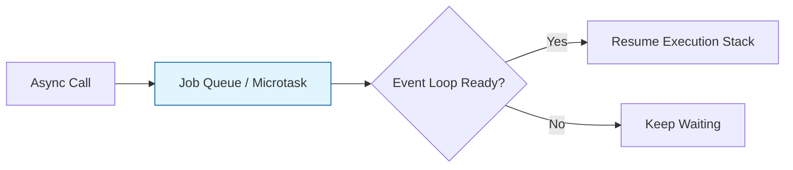

# CH-01: Async Control Flow (Control Flow & Async Evolution)

> **"Aliran Energi Tak Terputus. `Async Control Flow` membedah transformasi penanganan tugas asinkron di Hub dari antrean mentah menuju aliran yang elegan dan deterministik."**

**Source Hub**:
- [ECMA-262: Promise Objects](https://tc39.es/ecma262/#sec-promise-objects)
- [ECMA-262: Async Functions](https://tc39.es/ecma262/#sec-async-function-definitions)

---

## 1. Konsep & Esensi

**Definisi Arsitek**:
JavaScript bersifat single-threaded. **Promises** dan **Async/Await** mengatur antrean energi agar tugas I/O tidak memblokir sirkuit utama.

**Boundary**:
Chapter ini memprioritaskan mekanisme tematik async modern. Untuk milestone rilis seperti `Top-level await`, lihat **[BK-06: Structural Reinforcement](../../BK-06_StructuralReinforcement/)**.

**Model Mental**:
- **Promise**: Tiket janji penyelesaian kerja yang diproses di belakang layar.
- **Async/Await**: Panel kontrol yang membuat jalur asynchronous terlihat sinkron bagi operator.

---

## 2. Visualisasi Sistem: Async Pipeline

---

## 3. Mekanisme & Hubungan

### Infrastruktur Asinkron
1. **Promise Internals**: Promise memiliki state internal yang hanya berubah sekali.
2. **Async/Await Magic**: Async/await membungkus alur asinkron dalam struktur yang lebih mudah dibaca.
3. **Job Queue**: Penyelesaian promise dijadwalkan melalui microtask queue sebelum siklus event loop berikutnya.

---

## 4. Arsitek Mindset
Rancang aliran asinkron sebagai sirkuit paralel yang terukur. Gunakan `Promise.all` untuk concurrency, dan `async/await` untuk menjaga kejelasan alur bisnis.

---

## 5. Lab Praktis
1. **[Promise Identity](./examples/01_promise_identity.js)**: Membedah state promise dan perilaku microtask queue.
2. **[Async Flow Sync](./examples/02_async_flow_sync.js)**: Menunjukkan bagaimana `await` menata tugas asinkron menjadi alur sekuensial yang lebih jelas.

---
*Status: [x] Complete.*
