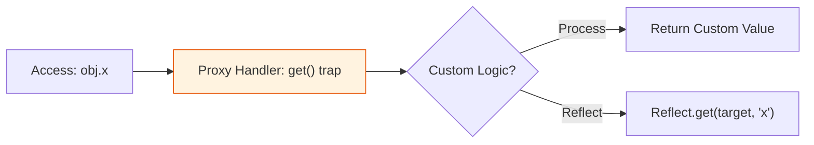

# CH-01: Proxy Reflection (Metaprogramming & Reflection)

> **"Kesadaran Diri Hub. `Proxy Reflection` membedah kemampuan JavaScript untuk memeriksa, menginterupsi, dan memanipulasi perilakunya sendiri secara dinamis."**

**Source Hub**:
- [ECMA-262: Proxy Objects](https://tc39.es/ecma262/#sec-proxy-objects)
- [ECMA-262: The Reflect Object](https://tc39.es/reflect-object)

---

## 1. Konsep & Esensi

**Definisi Arsitek**:
Metaprogramming adalah menulis kode yang memanipulasi kode lain. **Proxy** bertindak sebagai lapisan intersepsi, sementara **Reflect** menyediakan toolkit untuk memanggil operasi default engine secara eksplisit.

**Model Mental**:
- **Proxy**: Gerbang sensor yang bisa menghentikan, memvalidasi, atau meneruskan akses.
- **Reflect**: Panel alat resmi untuk memanggil operasi default secara bersih.

---

## 2. Visualisasi Sistem: Proxy Interception Layer

---

## 3. Mekanisme & Hubungan

### Infrastruktur Refleksi
1. **Proxy Traps** dapat mencegat hampir seluruh metode internal penting seperti `get`, `set`, `has`, dan `apply`.
2. **Reflect API** menyediakan operasi default yang sejalan dengan internal methods engine.
3. **Symbols & Metadata** membantu mencegah tabrakan identitas pada skenario metaprogramming yang kompleks.

---

## 4. Arsitek Mindset
Gunakan **Proxy** untuk abstraksi tingkat tinggi seperti sistem reaktivitas atau validasi skema. Hindari pemakaian berlebih pada jalur performa kritis karena intersepsi membawa overhead.

---

## 5. Lab Praktis
1. **[Proxy Interceptor](./examples/01_proxy_interceptor.js)**: Menggunakan trap `get` dan `set` untuk validasi otomatis.
2. **[Reflect Toolkit](./examples/02_reflect_toolkit.js)**: Menggunakan `Reflect` untuk operasi objek yang lebih bersih dan terprediksi.

---
*Status: [x] Complete.*
