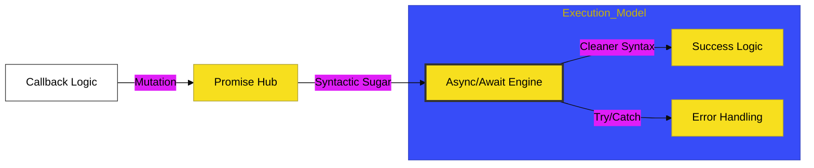

# BK-02: Logical Flow & Metaprogramming

> **"Alur Logika: Membedah Mutasi Kontrol Asinkron dan Injeksi Interseptor Metaprogramming."**

---

## 🔗 Source Hub
- **Primary Source**: [MDN Web Docs - Async functions](https://developer.mozilla.org/en-US/docs/Web/JavaScript/Reference/Statements/async_function)
- **Technical Reference**: [ECMA-262 - Proxy Objects](https://tc39.es/ecma262/#sec-proxy-objects)
- **Conceptual Parent**: [RAK-03 Evolution](../README.md)

---

## 🌓 1. Essence: The Logic
Logika adalah penggerak sirkuit. Di **BK-02**, kita membedah mekanisme internal bagaimana JavaScript berevolusi dari model linear yang kaku menuju model **Asinkron Deklaratif**. Memahami **Logical Flow** modern memungkinkan Anda mengelola operasi I/O yang berat tanpa mematikan sirkuit utama thread tunggal.

Selain asinkronitas, kita juga menjelajahi **Metaprogramming** melalui Proxy dan Reflect. Ini bukan fitur biasa; ini adalah kemampuan bahasa untuk "Memikirkan Dirinya Sendiri", memungkinkan penciptaan sistem reaktif dan interseptor logika yang sebelumnya tidak mungkin dilakukan di ES5.

---

## 🎨 2. Visual Logic: The Evolutionary Async Flow
Mekanisme transisi dari kontrol manual menuju otomatisasi asinkron:

---

## 🏛️ 3. Sections Atlas
- **[CH-01: Async Control Flow](./CH-01_AsyncControlFlow/)**: Membedah teknik pengolahan operasi asinkron tingkat lanjut.
- **[CH-02: Proxy Reflection](./CH-02_ProxyReflection/)**: Meninjau sejarah dan implikasi penggunaan interseptor objek di level bahasa.

---

## 🧪 4. The Lab (Logic Lab)
Uji ketajaman transisi asinkron dan interseptor di laboratorium:
- `../examples/async_evolution_demo.js`

---

## ⚠️ 5. Common Pitfalls & Myths
- **Mitos**: *"Async/Await adalah Threading."* (Salah, JavaScript tetap **Single-Threaded**. `async/await` hanyalah cara yang lebih indah untuk menulis **Promises**. Jangan tertipu dengan tampilan linearnya; alur tetap asinkron di bawah kap mesin).
- **Mitos**: *"Proxy bisa mencegat semua hal tanpa batas."* (Faktanya, ada beberapa operasi internal engine yang tidak bisa dicegat sepenuhnya. Gunakan **Reflect** di dalam trap Proxy Anda untuk menjaga sirkuit tetap sinkron dengan standar bahasa).

---
*Back to [Modern Core Evolution](../README.md)*
