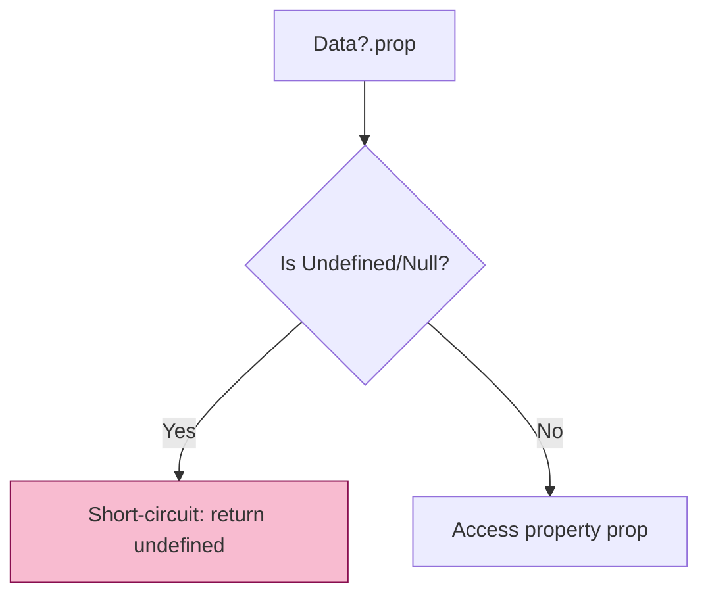

# CH-01: Data Safety (Data Resilience & Safety)

> **"Ketahanan Sirkuit Data. `Data Safety` membedah fitur-fitur yang menjaga aliran data tetap stabil, presisi, dan tidak mudah pecah."**

**Source Hub**:
- [ECMA-262: Optional Chaining](https://tc39.es/ecma262/#sec-optional-chaining-operator)
- [ECMA-262: BigInt Objects](https://tc39.es/ecma262/#sec-bigint-objects)

---

## 1. Konsep & Esensi

**Definisi Arsitek**:
Aplikasi modern sering berurusan dengan data eksternal yang tidak menentu. **Optional Chaining** dan **Nullish Coalescing** mencegah kerusakan saat akses data gagal, sementara **BigInt** menjaga presisi angka besar.

**Boundary**:
Chapter ini memusatkan model mental fitur ketahanan data modern. Untuk arsip era ES2020-2021, lihat **[BK-05: Reliability Patches](../../BK-05_ReliabilityPatches/)**.

**Model Mental**:
- **Safety Valves**: Katup pengaman agar aliran data tidak meledak saat jalur terputus.
- **BigInt**: Jalur presisi terpisah untuk angka yang melampaui kapasitas number biasa.

---

## 2. Visualisasi Sistem: Short-Circuiting Flow

---

## 3. Mekanisme & Hubungan

### Infrastruktur Ketahanan
1. **Optional Chaining** menghentikan reference traversal saat base nullish.
2. **Nullish Coalescing** hanya bereaksi pada `null` dan `undefined`, bukan semua nilai falsy.
3. **BigInt Isolation** menjaga presisi tinggi dengan domain operasi yang terpisah dari `Number`.

---

## 4. Arsitek Mindset
Gunakan `?.` untuk data yang skemanya tidak stabil, `??` untuk default presisi, dan **BigInt** hanya saat kebutuhan presisi memang melewati batas aman number biasa.

---

## 5. Lab Praktis
1. **[Safety Chaining](./examples/01_safety_chaining.js)**: Demonstrasi ketahanan aplikasi terhadap data nullish.
2. **[BigInt Integrity](./examples/02_bigint_integrity.js)**: Pembuktian presisi BigInt pada angka raksasa.

---
*Status: [x] Complete.*
