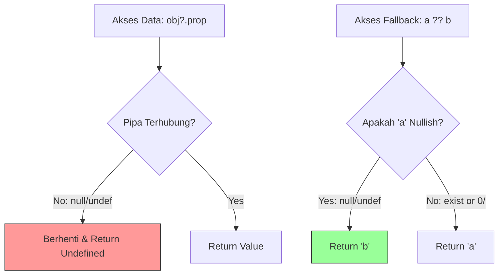

# CH-01: Safety Valves (Optional Chaining & Nullish Coalescing)

> **"Di dalam Grid yang luas, data seringkali hilang atau tidak lengkap. Optional Chaining dan Nullish Coalescing adalah 'Katup Pengaman' (Safety Valves) yang mencegah sistem Hub mengalami crash saat mencoba mengakses energi dari pipa yang kosong."**

**Source Hub**: 
- [MDN: Optional Chaining (?.)](https://developer.mozilla.org/en-US/docs/Web/JavaScript/Reference/Operators/Optional_chaining)
- [MDN: Nullish Coalescing (??)](https://developer.mozilla.org/en-US/docs/Web/JavaScript/Reference/Operators/Nullish_coalescing)
- [ECMA-262: Optional Chain](https://tc39.es/ecma262/#sec-optional-chains)

---

## 1. Konsep & Esensi

**Definisi Arsitek**:
ES2020 memperkenalkan dua operator krusial untuk menangani nilai `null` atau `undefined` secara deklaratif. **Optional Chaining** memungkinkan akses properti tanpa risiko `TypeError`, sementara **Nullish Coalescing** menyediakan nilai fallback yang presisi hanya untuk tipe data *nullish*.

**Placement**:
Chapter ini adalah arsip rilis ES2020. Untuk model mental lintas-era yang menempatkan fitur ini di dalam tema ketahanan data modern, baca juga **[BK-03: Data Resilience & Safety](../../BK-03_DataResilience/README.md)**.

**Model Mental**:
- **Optional Chaining (`?.`)**: Seperti memeriksa apakah sebuah pipa terhubung sebelum mencoba membukanya. Jika pipa tidak ada, aliran berhenti dengan aman (mengembalikan `undefined`) alih-alih meledakkan sistem.
- **Nullish Coalescing (`??`)**: Seperti katup cadangan yang hanya terbuka jika sumber utama benar-benar kosong (`null` atau `undefined`), bukan sekadar bertekanan rendah (seperti angka `0` atau string kosong `""`).

---

## 2. Visualisasi Sistem: Alur Katup Pengaman



---

## 3. Mekanisme & Hubungan

### Akses Data Mendalam (Optional Chaining)
Mencegah error "Cannot read property of undefined" pada objek bersarang.
```javascript
const temp = unit?.sensors?.temperature;
```

### Nilai Default yang Cerdas (Nullish Coalescing)
Berbeda dengan operator OR (`||`), `??` tidak menganggap `0`, `false`, atau `""` sebagai nilai yang harus diganti.
```javascript
const load = signal.load ?? 100; 
// Jika signal.load = 0, load tetap 0 (bukan 100).
```

### Arsitek Mindset: Ketahanan Aliran Data
- Gunakan `?.` pada titik-titik integrasi API yang skemanya mungkin berubah atau tidak konsisten.
- Gunakan `??` untuk konfigurasi di mana angka `0` adalah nilai input yang valid.

---

## 4. Lab Praktis
Buka file `examples/01_safety_valves_lab.js` untuk menguji fallback nullish dan akses properti aman pada skenario umum.

Gunakan juga `examples/02_deep_access_lab.js` untuk mensimulasikan akses data bertingkat yang rawan putus di tengah jalur.

---
*Status: [x] Complete.*
