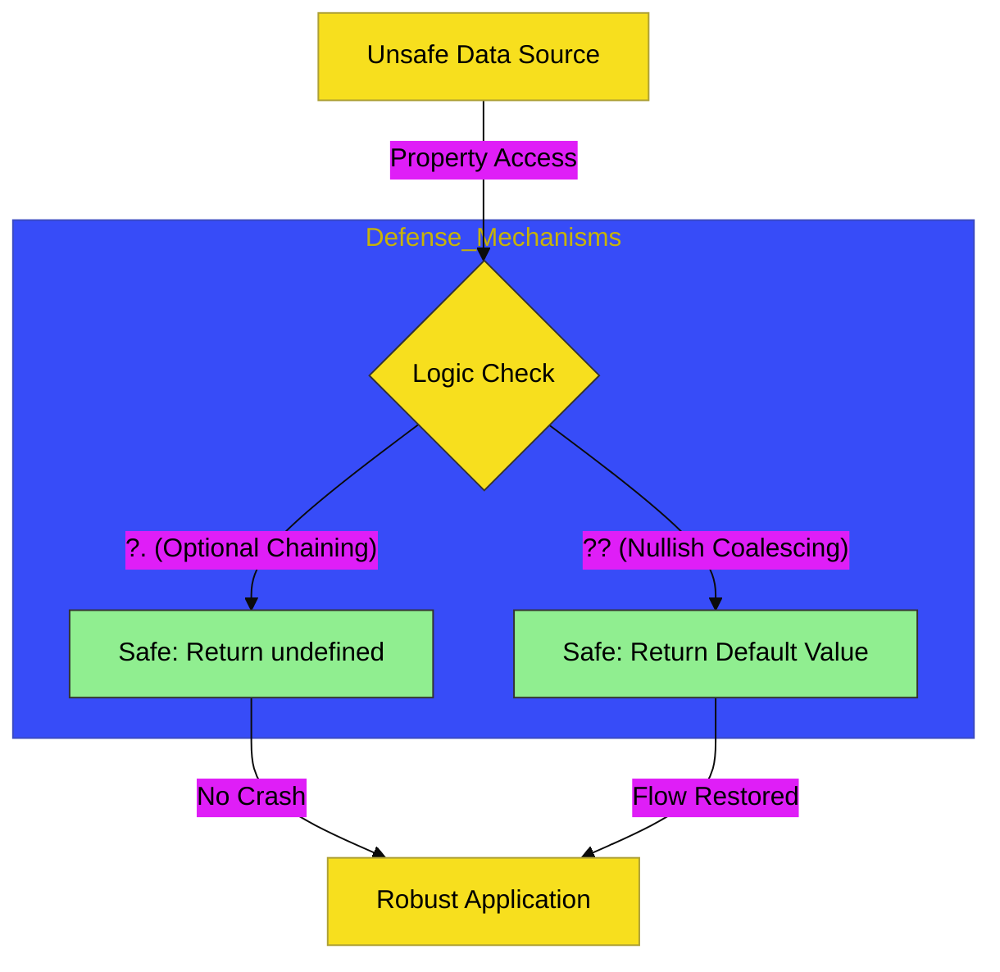

# BK-03: Resilience & Safety Hub

> **"Pusat Ketahanan: Membedah Mekanisme Pertahanan Logika dan Integritas Data Modern."**

---

## 🔗 Source Hub
- **Primary Source**: [MDN Web Docs - Optional chaining](https://developer.mozilla.org/en-US/docs/Web/JavaScript/Reference/Operators/Optional_chaining)
- **Technical Reference**: [ECMA-262 - Nullish Coalescing Operator](https://tc39.es/ecma262/#sec-binary-logical-operators)
- **Conceptual Parent**: [RAK-03 Evolution](../README.md)

---

## 🌓 1. Essence: The Logic
Keamanan sirkuit adalah segalanya. Di **BK-03**, kita membedah mekanisme internal evolusi JavaScript menuju bahasa yang lebih **Defensif**. Memahami **Resilience Hub** memungkinkan Anda mengelola data yang tidak lengkap atau objek yang dalam keadaan "Fragile" tanpa risiko mematikan thread eksekusi utama.

Di sini, kita melihat bagaimana operator penyelemat seperti `?.` dan `??` lahir dari kebutuhan industri untuk mengurangi error `Cannot read property of undefined` yang telah menghantui JavaScript selama puluhan tahun. Ini adalah evolusi menuju **Integritas Data** yang lebih tinggi.

---

## 🎨 2. Visual Logic: Safe Logic Patterns
Mekanisme penapisan nilai berbahaya melalui operator pertahanan modern:

---

## 🏛️ 3. Sections Atlas
- **[CH-01: Data Safety](./CH-01_DataSafety/)**: Membedah teknik pembekuan data dan penggunaan konstanta imutabel untuk integritas memori.
- **[CH-02: Safety Valves](./CH-02_SafetyValves/)**: Meninjau penggunaan katup pengaman modern (`?.`, `??`) dalam aliran data dinamis.
- **[CH-03: Logical Assignment](./CH-03_LogicalAssignment/)**: Menjelaskan mutasi penugasan logika (`||=`, `&&=`, `??=`) untuk kode yang lebih bersih dan aman.

---

## 🧪 4. The Lab (Resilience Lab)
Uji ketajaman mekanisme pertahanan data di laboratorium:
- `../examples/safety_operators_demo.js`

---

## ⚠️ 5. Common Pitfalls & Myths
- **Mitos**: *"Optional Chaining (`?.`) adalah pengganti `if` statement."* (Salah, `?.` hanya menangani pengecekan keberadaan properti. Jangan menggunakannya untuk logika bisnis yang kompleks; ia adalah **Pelindung Sirkuit**, bukan pengganti arsitektur percabangan Anda).
- **Mitos**: *"Nullish Coalescing (`??`) identik dengan logical OR (`||`).* (Sangat berbahaya; arsitek Hub harus tahu bahwa `||` menganggap angka `0` dan string kosong `""` sebagai `false`, sementara `??` hanya menganggap `null` dan `undefined` sebagai target. Gunakan `??` jika Anda ingin mempertahankan nilai `0` atau `""` di dalam sirkuit data Anda).

---
*Back to [Modern Core Evolution](../README.md)*
