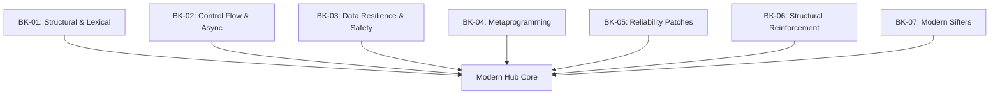

# SR-02: Modern Core Evolution (ES2015 - ES2024)

> **"Mutasi Genetik Hub. `SR-02` membedah fitur-fitur modern yang mengubah cara sirkuit JavaScript dibangun, dari penguatan leksikal hingga pemrosesan asinkron tak terbatas."**

**Source Hub**:
- [ECMA-262: History and ESNext](https://tc39.es/ecma262/#sec-history)

---

## The 7 Modern Pillars

---

## Koleksi Buku:
1. **[BK-01: Structural & Lexical](./BK-01_StructuralLexical/)**: Pilar tematik untuk class, modules, arrow functions, dan lexical scoping.
2. **[BK-02: Control Flow & Async](./BK-02_ControlFlowAsync/)**: Pilar tematik untuk promises, async/await, dan model aliran asinkron.
3. **[BK-03: Data Resilience & Safety](./BK-03_DataResilience/)**: Pilar tematik untuk optional chaining, nullish coalescing, dan BigInt.
4. **[BK-04: Metaprogramming & Reflection](./BK-04_Metaprogramming/)**: Pilar tematik untuk proxy, reflect, dan symbols.
5. **[BK-05: Reliability Patches](./BK-05_ReliabilityPatches/)**: Arsip kronologis ES2020-2021.
6. **[BK-06: Structural Reinforcement](./BK-06_StructuralReinforcement/)**: Arsip kronologis ES2022-2023.
7. **[BK-07: Modern Sifters](./BK-07_ModernSifters/)**: Arsip kronologis ES2024+.

### Boundary

- `BK-01` sampai `BK-04` adalah buku payung tematik untuk memahami mekanisme inti modern JavaScript.
- `BK-05` sampai `BK-07` adalah arsip era/rilis yang memberi konteks kronologis dan chapter detail tambahan.
- Jika topik tampak beririsan, prioritaskan buku tematik untuk model mental dan buku arsip untuk jejak evolusinya.

---
*Back to [RAK-03](../README.md)*
