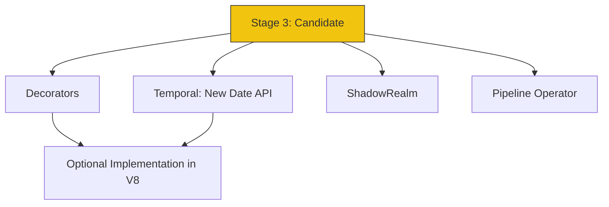

# CH-02: Near Completion (Stage 3)

> **"Kesiapan Produksi. `Near Completion` adalah tahap di mana sirkuit baru sudah dianggap stabil dan siap untuk diimplementasikan oleh engine browser."**

**Source Hub**: 
- [TC39 Stage 3 Proposals](https://github.com/tc39/proposals)

---

## 1. Konsep & Esensi

**Definisi Arsitek**:
**Stage 3** (Candidate) berarti fitur sudah selesai secara desain. Tidak ada lagi perubahan desain kecuali jika ditemukan bug kritis saat implementasi. Ini adalah sinyal bagi vendor (V8, JavaScriptCore, Spidermonkey) untuk mulai membangun sirkuit aslinya di dalam engine Hub.

**Model Mental**:
Gedung baru sudah selesai dibangun (Stage 3). Sekarang tinggal menunggu tim inspeksi (Browser implementers) untuk memeriksa kabel dan memastikan semuanya aman sebelum penghuni pertama (Developers) diizinkan masuk secara resmi.

---

## 2. Visualisasi Sistem: Stage 3 Feature Radar

---

## 3. Mekanisme & Hubungan

### Kriteria Masuk Stage 4 (Clause 5 logic)
Untuk lulus dari Stage 3, sebuah fitur harus:
1. Memiliki teks spesifikasi yang sudah ditandatangani oleh **Designated Reviewers**.
2. Memiliki setidaknya **dua implementasi yang kompatibel** (misal: sudah jalan di Chrome dan Firefox).
3. Lulus semua tes di **Test262** (kumpulan tes standar internasional).

### Arsitek Mindset: Early Adoption
- Stage 3 adalah "Green Light" untuk mulai mempelajari fitur tersebut dengan serius. Anda bisa mulai menggunakannya di proyek eksperimental dengan bantuan Transpiler (seperti Babel) atau flag khusus di Node.js. Fitur-fitur ini sangat kecil kemungkinannya untuk gagal.

---

## 4. Lab Praktis
Buka file `examples/01_future_sneak_peek.js` untuk mencoba simulasi proposal seperti Temporal dan immutable records sebagai gambaran fitur masa depan Hub.

---
*Status: [x] Complete.*
