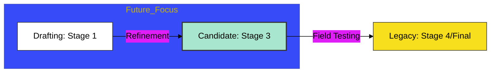

# BK-01: Active Proposals

> **"Cakrawala Masa Depan: Membedah Kandidat Fitur yang Sedang Membentuk Wajah Baru JavaScript."**

---

## 🔗 Source Hub
- **Primary Source**: [TC39 - Active Proposals](https://github.com/tc39/proposals)
- **Technical Reference**: [TC39 - Stage 1-3 Proposals](https://github.com/tc39/proposals/blob/main/stage-1-proposals.md)
- **Conceptual Parent**: [RAK-03 Evolution](../README.md)

---

## 🌓 1. Essence: The Logic
Masa depan tidak datang secara tiba-tiba; ia sedang dirancang. Di **BK-01**, kita membedah mekanisme internal bagaimana proposal aktif (Stage 1-3) dipersiapkan untuk menjadi standar masa depan. Memahami **Active Proposals** memungkinkan Anda untuk tidak hanya menjadi pengguna bahasa, tetapi arsitek yang siap menyongsong perubahan paradigma (seperti *Temporal API* atau *Decorators*).

Di sini, kita melihat JavaScript sebagai entitas yang adaptif, terus berevolusi untuk menangani kompleksitas aplikasi web modern dan tantangan komputasi masa depan secara kinetik.

---

## 🎨 2. Visual Logic: The Proposal Maturity Flow
Mekanisme pengkristalan ide menuju stabilitas kandidat:

---

## 🏛️ 3. Sections Atlas
- **[CH-01: Proposals](./CH-01_Proposals/)**: Membedah teknik pemantauan proposal aktif dan cara membaca dokumen teknis (*explainer*).
- **[CH-02: Ecosystem Readiness](./CH-01_Proposals/)**: Meninjau kesiapan ekosistem (Transpiler/Polyfill) untuk mendukung fitur masa depan secara aman.

---

## 🧪 4. The Lab (Horizon Lab)
Pantau dan uji coba proposal masa depan di laboratorium virtual:
- `https://github.com/tc39/proposals/blob/main/README.md`

---

## ⚠️ 5. Common Pitfalls & Myths
- **Mitos**: *"Setiap proposal pasti akan berakhir di Stage 4."* (Salah, banyak proposal yang tertahan di Stage 1 atau 2 selama bertahun-tahun atau bahkan ditarik kembali jika komite menemukan masalah arsitektural yang fundamental. Jangan membangun infrastruktur kritis di atas fitur Stage 1).
- **Mitos**: *"Gunakan Babel untuk semua fitur Stage 0."* (Sangat berbahaya; fitur Stage 0 bersifat **Strawman** dan sangat tidak stabil. Arsitek Hub yang bijak hanya akan mengeksplorasi Stage 0 untuk riset, namun hanya mengimplementasikan (dengan transpilasi) fitur mulai dari Stage 3).

---
*Back to [Future Hub Proposals](../README.md)*
