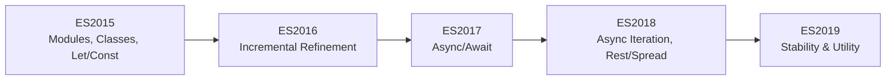

# CH-01: The Modern Era (ES2015-2019)

> **"Gelombang modernisasi pertama. `The Modern Era` menandai fase saat JavaScript berpindah dari lompatan dekade ke ritme evolusi tahunan."**

**Source Hub**:
- [ECMA-262 Editions](https://ecma-international.org/publications-and-standards/standards/ecma-262/)
- [TC39 Finished Proposals](https://github.com/tc39/proposals/blob/main/finished-proposals.md)

---

## 1. Konsep & Esensi

**Definisi Arsitek**:
Periode ES2015-ES2019 adalah fase ketika JavaScript membangun fondasi modernnya: modules, classes, promises, async/await, serta perbaikan besar pada koleksi dan ergonomi sintaks.

**Model Mental**:
Bayangkan Hub yang sebelumnya hanya direnovasi besar-besaran sekali dalam waktu lama, lalu mulai beralih ke jadwal pembaruan rutin yang lebih kecil namun jauh lebih cepat.

---

## 2. Visualisasi Sistem: Early Annual Modernization

---

## 3. Mekanisme & Hubungan

### Fase Modern Era
1. **ES2015** membuka fondasi arsitektur modern JavaScript.
2. **ES2016-2017** memperkuat ritme incremental dengan fitur yang lebih terarah.
3. **ES2018-2019** menstabilkan ekosistem lewat penyempurnaan ergonomi dan kemampuan async.

### Nil Content
Unit ini tidak membutuhkan Lab Praktis/Visualisasi tambahan di luar diagram inline karena bersifat timeline naratif-historis.

---

## 4. Lab Praktis
Unit ini tidak membutuhkan Lab Praktis kode karena berfungsi sebagai peta sejarah rilis tahunan.

---
*Status: [x] Complete.*
