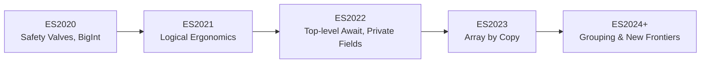

# CH-02: The Continuous Flux (ES2020-2024+)

> **"Gelombang penyempurnaan beruntun. `The Continuous Flux` merekam bagaimana JavaScript modern bergerak lewat rilis kecil yang konsisten namun berdampak besar."**

**Source Hub**:
- [TC39 Finished Proposals](https://github.com/tc39/proposals/blob/main/finished-proposals.md)
- [ECMA-262 Current Edition](https://tc39.es/ecma262/)

---

## 1. Konsep & Esensi

**Definisi Arsitek**:
Periode ES2020-ES2024+ menunjukkan pola evolusi berkelanjutan: fitur baru dirilis dalam gelombang yang lebih cepat, lebih fokus, dan makin dekat dengan kebutuhan aplikasi modern seperti safety, immutability, dan data transformation.

**Model Mental**:
Jika era sebelumnya membangun tulang rangka Hub, fase ini seperti menambahkan lapisan proteksi, panel otomatis, dan alat klasifikasi baru sedikit demi sedikit tanpa menunggu renovasi besar berikutnya.

---

## 2. Visualisasi Sistem: Continuous Annual Flow

---

## 3. Mekanisme & Hubungan

### Fase Continuous Flux
1. **ES2020-2021** memusatkan reliability dan ergonomi ekspresi.
2. **ES2022-2023** memperkuat struktur modul, class, dan immutability.
3. **ES2024+** membawa fitur frontier yang makin deklaratif dan data-centric.

### Nil Content
Unit ini tidak membutuhkan Lab Praktis/Visualisasi tambahan di luar diagram inline karena bersifat timeline naratif-historis.

---

## 4. Lab Praktis
Unit ini tidak membutuhkan Lab Praktis kode karena berfungsi sebagai peta sejarah rilis tahunan.

---
*Status: [x] Complete.*
