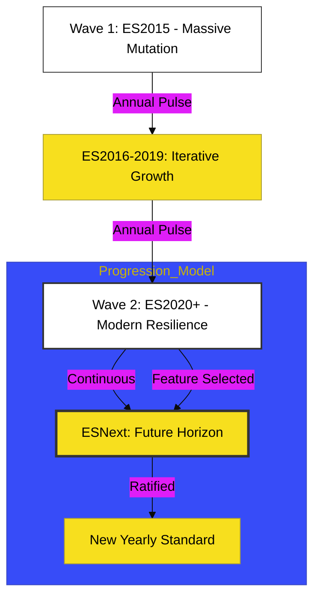

# BK-02: Release Timeline

> **"Ritme Evolusi: Membedah Denyut Rilis Tahunan dan Lini Masa Modernisasi JavaScript."**

---

## 🔗 Source Hub
- **Primary Source**: [ECMAScript - Finished Proposals](https://github.com/tc39/proposals/blob/main/finished-proposals.md)
- **Technical Reference**: [Ecma-262 - History](https://tc39.es/ecma262/#sec-history)
- **Conceptual Parent**: [RAK-03 Evolution](../README.md)

---

## 🌓 1. Essence: The Logic
Konsistensi adalah kunci. Di **BK-02**, kita membedah mekanisme internal bagaimana sejak tahun 2015, JavaScript bermutasi melalui **Annual Release Cycle**. Memahami **Release Timeline** memungkinkan arsitek Hub untuk melakukan pemetaan fitur berdasarkan versi (ES2015, ES2020, dsb) guna menjamin kompatibilitas runtime dan efisiensi transpilasi di Hub aplikasi.

Di sini, kita melihat bagaimana "Zaman Kegelapan" (jeda antara ES3 dan ES5) telah digantikan oleh ritme tahunan yang meledak secara kinetik, memastikan pengembang selalu memiliki instrumen terbaru untuk menangani tantangan web modern.

---

## 🎨 2. Visual Logic: The Annual Release Pulse
Mekanisme siklus rilis tahunan yang menjamin progresivitas stabil:

---

## 🏛️ 3. Sections Atlas
- **[CH-01: Modern Era](./CH-01_ModernEra/)**: Membedah teknik pemetaan fitur sejak revolusi ES2015 hingga ES2019.
- **[CH-02: Continuous Flux](./CH-02_ContinuousFlux/)**: Meninjau rilis tahunan terkini (ES2020+) dan tren mutasi bahasa masa depan secara kinetik.

---

## 🧪 4. The Lab (Timeline Lab)
Pantau kronologi fitur yang telah selesai secara real-time di laboratorium:
- `https://tc39.es/finished-proposals/`

---

## ⚠️ 5. Common Pitfalls & Myths
- **Mitos**: *"Setiap versi tahunan JavaScript membawa perubahan besar yang merombak bahasa."* (Salah, sejak ES2015, versi tahunan cenderung bersifat **Iterative**. Satu versi mungkin hanya merilis 2 atau 3 fitur kecil. Strategi rilis atomik ini mencegah kejutan arsitektural yang besar pada ekosistem web).
- **Mitos**: *"Tunggu hingga versi tahunan dirilis sebelum menggunakan fiturnya."* (Faktanya, sebagian besar fitur sudah tersedia di browser dan runtime (Node.js) segera setelah fitur tersebut mencapai **Stage 4**, bahkan sebelum dokumen standar tahunan resmi dipublikasikan oleh ECMA).

---
*Back to [Future Hub Proposals](../README.md)*
