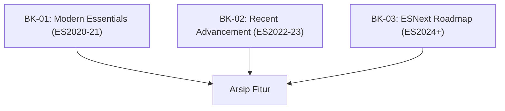

# SR-03: Language Features (The Evolutionary Archive)

> **"Katalog Kemajuan Hub. SR-03 membedah 'Fitur Bahasa'—arsip kronologis dari fitur-fitur yang telah mencapai kematangan penuh (Stage 4) dan menjadi standar baru."**

**Source Hub**: 
- [ECMA-262: Finished Proposals](https://github.com/tc39/proposals/blob/main/finished-proposals.md)

---

## 🏗️ The 3 Pillars of Feature Evolution

---

## Koleksi Buku:
1.  **[BK-01: Modern Essentials (ES2020-2021)](./BK-01_ES2020_21/)**: Optional Chaining, Nullish Coalescing, Logical Assignment, dan Promise settling.
2.  **[BK-02: Recent Advancement (ES2022-2023)](./BK-02_ES2022_23/)**: Top-level await, Private fields, Object.hasOwn, dan Array.at().
3.  **[BK-03: ESNext Roadmap (ES2024+)](./BK-03_ES2024_Plus/)**: Fitur-fitur terbaru yang baru saja disahkan atau sedang dalam tahap finalisasi rilis tahunan.

---
*Status: [status.md](../../status.md) | Back to [RAK-03](../README.md)*
