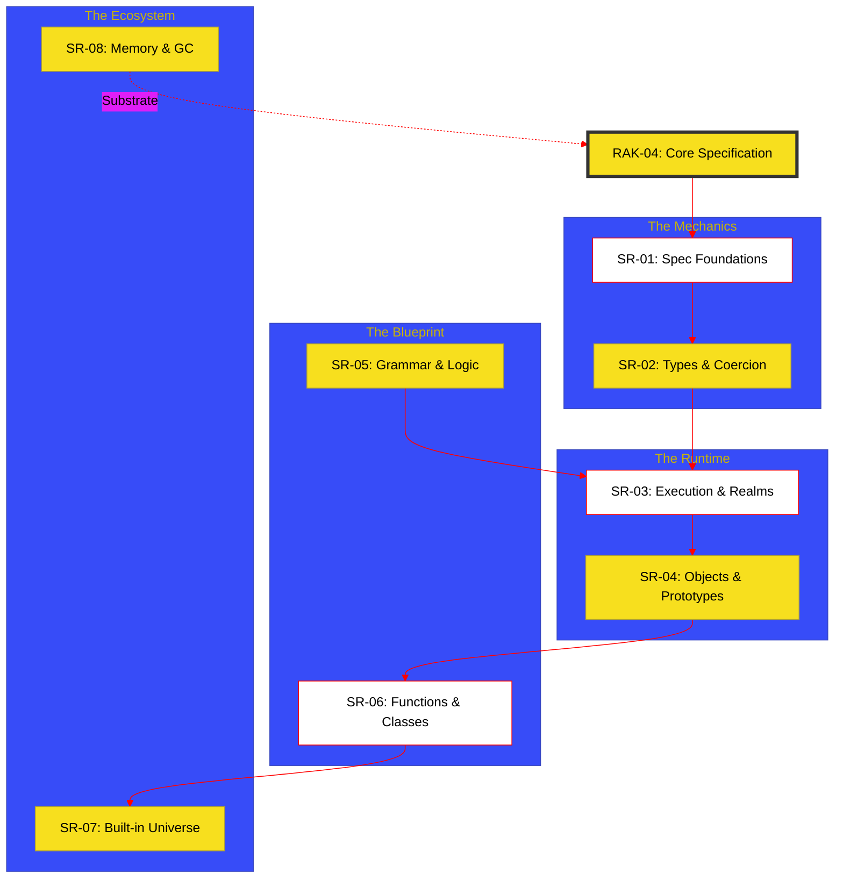

# RAK-04: Core Specification [REBORN]

> **"The Engine's Blueprint: Dekonstruksi Mekanika ECMA-262 di Level Arsitek."**

---

## 🔗 Source Hub
- **Primary Source**: [ECMA-262 (Standard ECMA-262, 14th edition)](https://tc39.es/ecma262/)
- **Technical Reference**: [TC39 Proposals Repository](https://github.com/tc39/proposals)
- **Strategic Parent**: [Blueprint: JavaScript Hub](../../../learning-matrix-blueprint/01-Language-Hubs/JavaScript-Knowledge-Base.md)

---

## 🌓 1. Essence: The Narrative
RAK-04 adalah "Ruang Bakar" (Combustion Chamber) di mana seluruh sintaks dari RAK-02 bertemu dengan aturan formal spesifikasi. Di sini, kita tidak lagi bertanya "Bagaimana cara menulisnya?", melainkan **"Bagaimana Engine mengevaluasinya?"**. 

Setiap fitur JavaScript dibedah menggunakan kacamata **Spec-Rigor**, mulai dari konvensi algoritma TC39 hingga manajemen memori tingkat rendah. Ini adalah pilar bagi mereka yang ingin memahami JavaScript bukan sekadar sebagai pengguna, melainkan sebagai **Language Architect**.

---

## 🗺️ 2. Landscape: The Spec-Core Map
RAK-04 mengonsolidasi 13 buku terfragmentasi menjadi 8 Strategic Hubs yang saling terkoneksi.

### 🎨 Visual Logic: The Kinetic Spec Flow

---

## 🏛️ 3. Strategic Hubs (8 Tracks)

1.  **[SR-01: Spec Foundations & Algorithm Mechanics](./SR-01-spec-foundations-mechanics/)**
    *Konvensi TC39, Completion Records, & Abstract Operations.*
2.  **[SR-02: Types & Coercion Semantics](./SR-02-types-and-values-semantics/)**
    *Primitif, Objek, & Logika Konversi algoritma `ToNumber`/`ToPrimitive`.*
3.  **[SR-03: Execution Context & Realm Orchestration](./SR-03-execution-context-realms/)**
    *Lexical Environments, Realms, Agents, & Jobs Queue.*
4.  **[SR-04: Object & Prototype Mechanics](./SR-04-object-prototype-mechanics/)**
    *Internal Slots, Internal Methods, & Evolusi Prototype Chain.*
5.  **[SR-05: Grammar & Control Flow](./SR-05-grammar-and-control-flow/)**
    *Lexical Analysis, Expression Evaluation, & Statement Control.*
6.  **[SR-06: Functional & Class Blueprints](./SR-06-functional-blueprints/)**
    *Function Objects, Closures, Meta-Properties, & Class Heritage.*
7.  **[SR-07: Standard Built-in Universe](./SR-07-standard-built-ins-universe/)**
    *Spesifikasi Objek Global dan API Intrinsik.*
8.  **[SR-08: Memory & Resource Landscape](./SR-08-memory-resource-landscape/)**
    *Memory Model, Garbage Collection, & Shared Memory Protocols.*

---

## 🎖️ 4. The Gold Standard (Adaptive 4+X)
Status transisi menuju Gold Standard:
- **Rule 0 (Research)**: Sinkronisasi dengan ECMA-262 (14th Edition).
- **Jiwa Visual**: Diagram Mermaid di setiap Hub README.
- **Mental Model**: Penekanan pada mekanika engine (V8/SpiderMonkey).

---
*Status: [/] Reconstruction in Progress. Mengacu pada Blueprint 8-Hub.*
