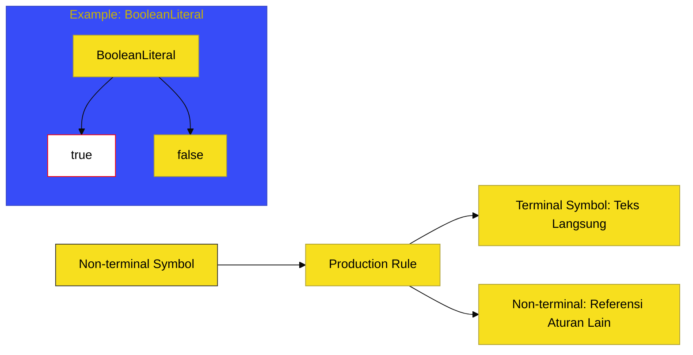

# BK-02: Grammar Notation System

> **"Cetak Biru Tata Bahasa: Membedah Sistem Notasi yang Menentukan Validitas Setiap Baris Kode Anda."**

---

## 🔗 Source Hub
- **Primary Source**: [ECMA-262: Notational Conventions (Clause 5.1)](https://tc39.es/ecma262/#sec-syntactic-and-lexical-grammars)
- **Technical Reference**: [ECMA-262: Grammar Notation (Clause 5.1.2)](https://tc39.es/ecma262/#sec-grammar-notation)

---

## 🌓 1. Essence: The Narrative

### Dual Definition
- **Formal**: Kerangka kerja formal berbasis **Context-Free Grammar (CFG)** yang digunakan oleh spesifikasi untuk mendeskripsikan secara presisi struktur leksikal dan sintaksis JavaScript melalui aturan produksi (Production Rules).
- **Analogi**: Bayangkan **"Mesin Pemeriksa Ejaan"** yang sangat ketat. Mesin ini tidak peduli apa maksud kode Anda; ia hanya peduli apakah urutan karakter yang Anda masukkan sesuai dengan pola yang diizinkan. Jika polanya salah (Syntax Error), mesin ini akan menolak memprosesnya sebelum kode tersebut sempat dijalankan.

---

## 🗺️ 2. Visual Logic: The Production Flow
Bagaimana spesifikasi menguraikan struktur grammar:

---

## 🏛️ 3. Structure: The Chapters

1.  **[CH-01: CFG and Primary Notation](./CH-01_GrammarNotation/)**
    *Simbol Terminal, Non-terminal, dan rantaian produksi dasar.*
2.  **[CH-02: Optionality and OneOf](./CH-02_GrammarShortcuts/)**
    *Penyederhanaan grammar: Notasi `[opt]`, `one of`, dan `list`.*
3.  **[CH-03: Grammatical Parameters and Constraints](./CH-03_GrammarParams/)**
    *Parameter sensitif konteks: `[Yield]`, `[Await]`, dan `[In]`.*
4.  **[CH-04: Line Restrictions and Lookahead](./CH-04_LineRestrictions/)**
    *Aturan "No Line Terminator Here" dan filter lookahead.*

---

## 🧠 4. Under-the-hood: Terminal vs Non-terminal
Di BK-02, kita memahami perbedaan sakral antara:
- **Terminal Symbols**: Karakter fisik yang Anda ketik (seperti `function`, `{`, `true`).
- **Non-terminal Symbols**: Nama kategori atau abstraksi (seperti `Statement`, `Expression`, `Literal`).

Salah satu rahasia paling dalam di sini adalah **Grammar Parameters**. Misalnya, aturan `Expression` akan berubah perilakunya jika berada di dalam generator (parameter `[Yield]`). Inilah mengapa `yield` hanya valid di dalam generator—bukan karena "sihir", tapi karena parameter grammar yang berbeda.

---
*Buku Status: [status.md](../../status.md) | Kembali ke [SR-01](../README.md)*
