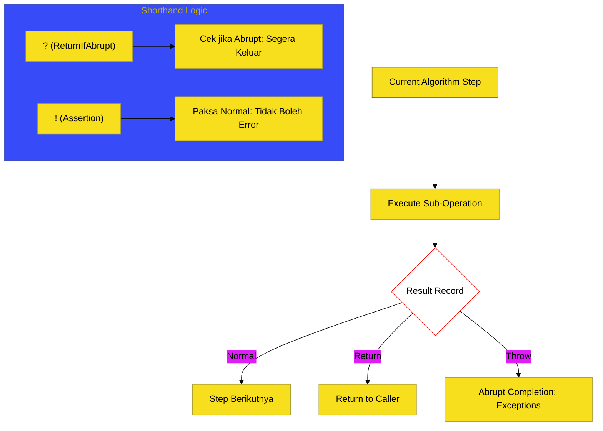

# BK-03: Algorithm Conventions

> **"Manual Instruksi Operasi: Membedah Logika Step-by-Step yang Menjamin Keamanan dan Kepastian Hasil Eksekusi."**

---

## 🔗 Source Hub
- **Primary Source**: [ECMA-262: Algorithm Conventions (Clause 5.2)](https://tc39.es/ecma262/#sec-algorithm-conventions)
- **Technical Reference**: [ECMA-262: Completion Records (Clause 6.2.4)](https://tc39.es/ecma262/#sec-completion-record-specification-type)

---

## 🌓 1. Essence: The Narrative

### Dual Definition
- **Formal**: Kumpulan prosedur dan konvensi penulisan algoritma abstrak yang digunakan oleh spesifikasi untuk mendeskripsikan perilaku operasional runtime ECMAScript secara presisi, mencakup penanganan status (Completion Records) dan notasi shorthand.
- **Analogi**: Bayangkan sebuah **"Resep Masakan Standar Internasional"**. Resep ini tidak hanya memberi tahu bahan-bahannya, tapi menginstruksikan langkah demi langkah: "Jika suhu mencapai 100 derajat, masukkan bahan A; jika tidak, hentikan proses." Di level spesifikasi, instruksi ini menjamin bahwa setiap engine (V8, JavaScriptCore) akan menghasilkan "masakan" yang sama persis untuk kode yang Anda tulis.

---

## 🗺️ 2. Visual Logic: The Completion Record Loop
Hampir setiap langkah algoritma dalam spesifikasi mengembalikan sebuah **Completion Record**:

---

## 🏛️ 3. Structure: The Chapters

1.  **[CH-01: Abstract Operations and Evaluation](./CH-01_EvaluationLogic/)**
    *Infrastruktur pemanggilan operasi dan urutan evaluasi.*
2.  **[CH-02: Completion Records and Errors](./CH-02_CompletionRecords/)**
    *Status normal, return, throw, break, dan continue.*
3.  **[CH-03: Records, Lists, and Internal Data](./CH-03_InternalData/)**
    *Struktur data internal yang digunakan untuk menyimpan status spec.*
4.  **[CH-04: Spec Mathematics and Shorthands](./CH-04_SpecMath/)**
    *Operasi aritmatika spek dan arti notasi singkat `?` serta `!`.*

---

## 🧠 4. Under-the-hood: The Magic of "?" and "!"
Di BK-03, kita memecahkan kode rahasia dalam spesifikasi:
- **`?` (ReturnIfAbrupt)**: Sebuah tanda yang berarti "Cek hasil operasi ini; jika hasilnya adalah error/abrupt, segera kembalikan ke pemanggil."
- **`!` (Assertion)**: Tanda yang berarti "Saya menjamin secara matematis bahwa operasi ini PASTI berhasil (Normal Completion)."

Memahami notasi ini akan membuat Anda bisa membaca algoritma kompleks di ECMA-262 secepat membaca teks biasa, memungkinkan Anda melacak bug hingga ke level logika spesifikasi paling dalam.

---
*Buku Status: [status.md](../../status.md) | Kembali ke [SR-01](../README.md)*
