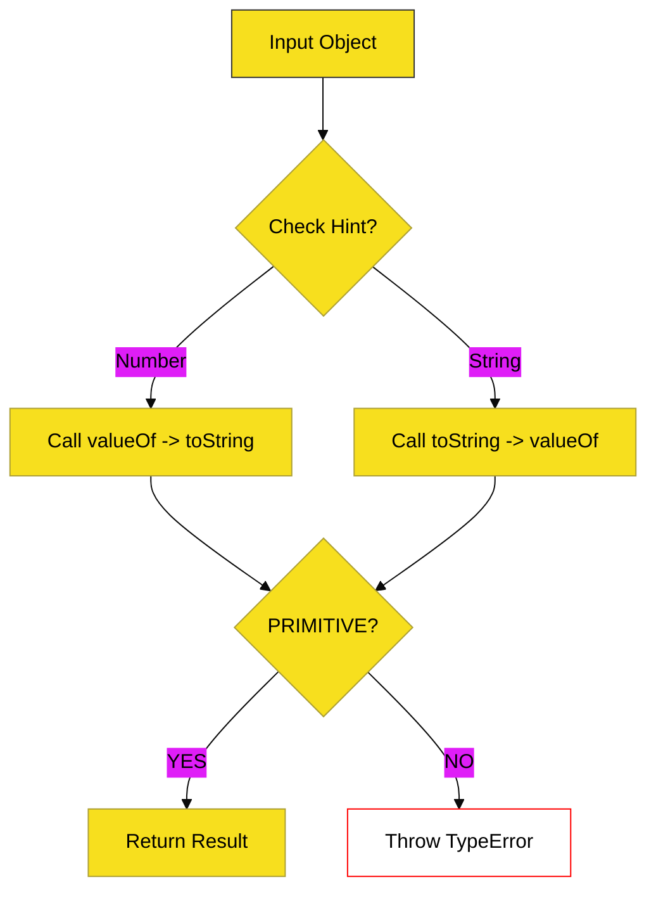

# BK-04: Type Conversion Logic

> **"Sistem Transmutasi: Membedah Sirkuit Algoritma yang Mengubah Partikel Data Antar Dimensi Tipe."**

---

## 🔗 Source Hub
- **Primary Source**: [ECMA-262: Type Conversion (Clause 7.1)](https://tc39.es/ecma262/#sec-type-conversion)
- **Technical Reference**: [ECMA-262: ToPrimitive (Clause 7.1.1)](https://tc39.es/ecma262/#sec-toprimitive)

---

## 🌓 1. Essence: The Narrative

### Dual Definition
- **Formal**: Serangkaian operasi abstrak internal (seperti `ToNumber`, `ToString`, dan `ToBoolean`) yang digunakan oleh spesifikasi untuk memaksa nilai ke tipe data tertentu secara konsisten, terutama melalui proses rekursif **`ToPrimitive`** untuk objek.
- **Analogi**: Bayangkan sebuah **"Alat Penukar Valas"**. Anda memasukkan mata uang String "10", dan alat tersebut memberikan Anda koin Number 10. Namun, terkadang Anda memasukkan benda aneh seperti Objek `{}`. Alat tersebut harus menjalankan prosedur pemeriksaan khusus: "Apakah saya bisa mengubah ini menjadi angka? Tidak? Kalau begitu saya coba ubah menjadi teks."

---

## 🗺️ 2. Visual Logic: The ToPrimitive Pipeline
Salah satu sirkuit paling krusial di BK-04 adalah alur konversi objek ke primitif:

---

## 🏛️ 3. Structure: The Chapters

1.  **[CH-01: Primitive Conversions](./CH-01_PrimitiveConversions/)**
    *Bedah teknis `ToNumber`, `ToString`, dan `ToBoolean` (Palsy/Truthy).*
2.  **[CH-02: Complex Conversions](./CH-02_ComplexConversions/)**
    *Deep dive mekanisme `ToPrimitive`, `ToObject`, dan `ToIndex`.*

---

## 🧠 4. Under-the-hood: The "Hint" Mechanics
Di BK-04, kita belajar bahwa engine tidak menebak secara sembarang. Setiap operasi konversi menyertakan sebuah **PreferredType** atau "Hint":
- **Hint "number"**: Digunakan dalam operasi matematika.
- **Hint "string"**: Digunakan dalam penggabungan string.
- **Hint "default"**: Digunakan pada operator `+` binari dan `==`.

Memahami urutan panggilan `valueOf()` dan `toString()` berdasarkan hint ini akan menjelaskan perilaku "aneh" JavaScript seperti `[] + []` atau mengapa `{} + []` bisa menghasilkan hasil yang berbeda di berbagai runtime.

---
*Buku Status: [status.md](../../status.md) | Kembali ke [SR-01](../README.md)*
