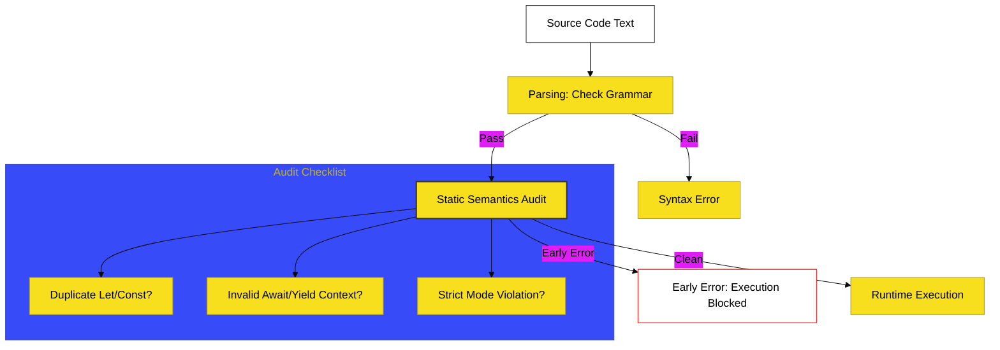

# BK-07: Static Semantic Rules

> **"Gerbang Pemeriksa Keamanan: Membedah Mekanisme Validasi yang Menolak Kode Secara Logis Sebelum Eksekusi Dimulai."**

---

## 🔗 Source Hub
- **Primary Source**: [ECMA-262: Static Semantic Rules (Clause 5.3)](https://tc39.es/ecma262/#sec-static-semantic-rules)
- **Technical Reference**: [ECMA-262: Early Errors (Clause 16.1.1)](https://tc39.es/ecma262/#sec-scripts-static-semantics-early-errors)

---

## 🌓 1. Essence: The Narrative

### Dual Definition
- **Formal**: Evaluasi pohon sintaksis (Abstract Syntax Tree) yang dilakukan setelah parsing selesai namun sebelum kode dieksekusi. Fase ini bertanggung jawab untuk menegakkan aturan yang tidak dapat ditangkap oleh grammar BNF sederhana, seperti deteksi deklarasi variabel ganda dalam scope yang sama.
- **Analogi**: Bayangkan sebuah **"Simulasi Pra-Terbang"**. Anda mungkin sudah memiliki pesawat yang semua bautnya terpasang (Grammar Valid). Namun, inspektur keamanan (**Static Semantics**) menyadari bahwa Anda mencoba memasang dua mesin di satu sayap yang sama. Mesin simulasi akan memberikan sinyal merah (**Early Error**) dan melarang pesawat tersebut lepas landas, meskipun secara fisik semua bautnya beres.

---

## 🗺️ 2. Visual Logic: The Validation Pipeline
Urutan bagaimana JavaScript memproses kode Anda sebelum berjalan:

---

## 🏛️ 3. Structure: The Chapters

1.  **[CH-01: Static Semantics and Early Errors](./CH-01_StaticSemantics/)**
    *Infrastruktur audit statis dan mekanisme penolakan kode.*
2.  **[CH-02: Scoping and Context Rules](./CH-02_ScopingContext/)**
    *Validasi nama binding dan batasan penggunaan `await` serta `yield`.*

---

## 🧠 4. Under-the-hood: The "Early Error" Paradox
Di BK-07, kita mempelajari perbedaan penting antara **Runtime Error** dan **Early Error**. Early Error terjadi pada seluruh unit evaluasi (seperti satu file script atau module). 

Jika di baris ke-100 terdapat kesalahan semantik statis (misal: `let x; let x;`), maka baris ke-1 tidak akan pernah dijalankan sama sekali. Ini membuktikan bahwa JavaScript benar-benar memiliki fase kompilasi/analisis sebelum fase eksekusi, meruntuhkan mitos bahwa JavaScript adalah bahasa yang "hanya interpretasi murni."

---
*Buku Status: [status.md](../../status.md) | Kembali ke [SR-01](../README.md)*
