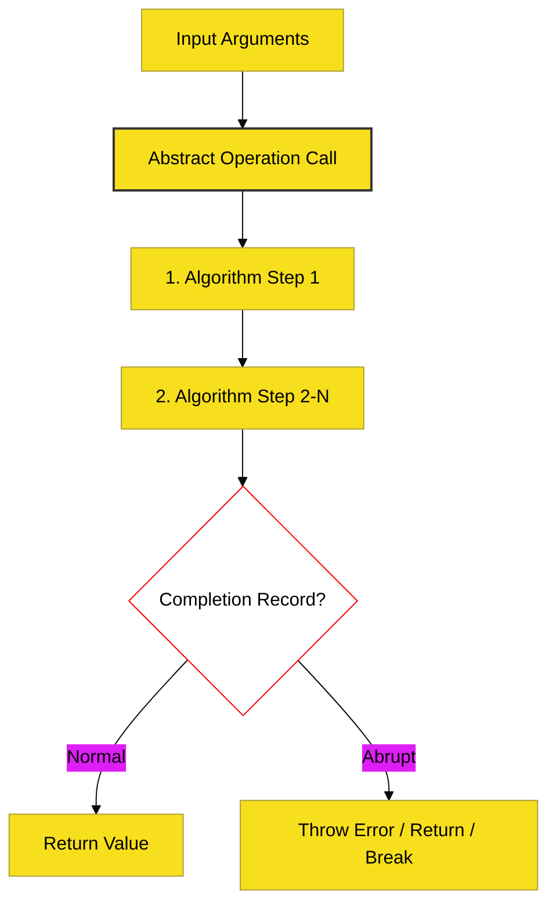

# SR-01: Spec Foundations & Algorithm Mechanics

> **"Manual Operasional Reaktor: Memahami Bagaimana Skema Spesifikasi ECMA-262 Dirancang dan Dieksekusi."**

---

## 🔗 Source Hub
- **Primary Source**: [ECMA-262: Notational Conventions (Clause 5)](https://tc39.es/ecma262/#sec-notational-conventions)
- **Technical Reference**: [ECMA-262: Abstract Operations (Clause 7)](https://tc39.es/ecma262/#sec-abstract-operations)

---

## 🌓 1. Essence: The Narrative

### Dual Definition
- **Formal**: Kumpulan konvensi notasi, algoritma dasar, dan operasi abstrak yang menjadi fondasi bagi seluruh perilaku bahasa ECMAScript. SR-01 mendefinisikan "bahasa di dalam bahasa" (Meta-Language) yang digunakan oleh TC39 untuk menspesifikasi JavaScript.
- **Analogi**: Bayangkan Anda sedang membaca **Buku Resep Masakan Raksasa**. Sebelum memasak (eksekusi kode), Anda harus tahu arti simbol bintang (`*`), apa itu "Completion Record" (hasil masakan: enak, gosong, atau kurang bumbu), dan bagaimana langkah-langkah diinstruksikan.

---

## 🗺️ 2. Visual Logic: The Algorithm Lifecycle
Setiap operasi di dalam spesifikasi (seperti `ToNumber` atau `Get`) mengikuti siklus hidup formal berikut:

---

## 🏛️ 3. Strategic Books (The Tracks)

1.  **[BK-01: Spec Foundations](./BK-01_Foundations/)**
    *Etika objek dan struktur dasar spesifikasi.*
2.  **[BK-02: Grammar Notations](./BK-02_GrammarNotation/)**
    *Sistem notasi grammar, shortcut, dan restrukturisasi baris.*
3.  **[BK-03: Algorithm Conventions](./BK-03_AlgorithmConventions/)**
    *Logika evaluasi, Completion Records, & Data Internal.*
4.  **[BK-04: Type Conversion Logic](./BK-04_TypeConversion/)**
    *Deep dive algoritma `ToNumber`, `ToString`, & `ToPrimitive`.*
5.  **[BK-05: Testing & Comparison](./BK-05_TestingComparison/)**
    *Mekanika algoritma kesetaraan (Equality) di level engine.*
6.  **[BK-06: Object Operations](./BK-06_ObjectOperations/)**
    *Operasi esensial objek: `Get`, `Set`, `HasProperty`, & `Delete`.*
7.  **[BK-07: Static Semantic Rules](./BK-07_StaticSemantics/)**
    *Aturan validasi sebelum kode dijalankan (Early Errors).*

---

## 🧠 4. Under-the-hood: Completion Records
Mekanisme internal terpenting di SR-01 adalah **Completion Records**. Setiap langkah algoritma tidak sekadar mengembalikan nilai, tapi sebuah "Record" yang berisi:
- `[[Type]]`: `normal`, `return`, `throw`, `break`, atau `continue`.
- `[[Value]]`: Nilai yang dihasilkan.
- `[[Target]]`: Label target (untuk break/continue).

Pemahaman mendalam tentang ini akan menjelaskan mengapa *Exceptions* menghentikan aliran kode dan bagaimana `try...catch` bekerja di level spesifikasi.

---
*Status: [/] Reconstruction in Progress. Mengacu pada Blueprint RAK-04.*
