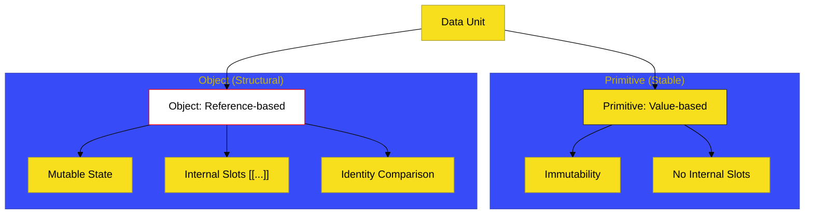

# BK-01: Core Language Types

> **"Partikel Dasar Materi: Membedah Blok Bangunan Terkecil yang Membentuk Seluruh Struktur Data dalam Ekosistem JavaScript."**

---

## 🔗 Source Hub
- **Primary Source**: [ECMA-262: ECMAScript Language Types (Clause 6.1)](https://tc39.es/ecma262/#sec-ecmascript-language-types)
- **Technical Reference**: [ECMA-262: The String Type (Clause 6.1.4)](https://tc39.es/ecma262/#sec-ecmascript-language-types-string-type)

---

## 🌓 1. Essence: The Narrative

### Dual Definition
- **Formal**: Definisi teknis mengenai delapan tipe data standar (Undefined, Null, Boolean, String, Symbol, Number, BigInt, dan Object) yang diakui oleh engine sebagai unit informasi yang valid.
- **Analogi**: Bayangkan **"Tabel Periodik Elemen"**. Ada elemen yang bersifat stabil dan tidak bisa diubah-ubah (**Primitif**), dan ada elemen kompleks yang bisa Anda susun menjadi senyawa kimia yang rumit (**Objek**). Pemahaman tentang atom-atom ini adalah kunci untuk memprediksi bagaimana mereka akan bereaksi saat dicampur dalam satu tabung reaksi (operasi kode).

---

## 🗺️ 2. Visual Logic: Primitive vs Object Anatomy
Perbedaan mendasar bagaimana data disimpan dan diakses:

---

## 🏛️ 3. Structure: The Chapters

1.  **[CH-01: Undefined, Null, dan Boolean](./CH-01_UndefinedNullBoolean/)**
    *Singleton types dan logika ketiadaan nilai.*
2.  **[CH-02: String and Text Processing](./CH-02_StringTextProcessing/)**
    *Arsitektur UTF-16, Immutability, dan manipulasi teks.*
3.  **[CH-03: Symbols and Global Metadata](./CH-03_SymbolsMetadata/)**
    *Identitas unik, Well-Known Symbols, dan meta-programming.*
4.  **[CH-04: Object Infrastructure](./CH-04_ObjectInfrastructure/)**
    *Fondasi internal objek Ordinary vs Exotic.*

---

## 🧠 4. Under-the-hood: String Immortality
Di BK-01, kita mempelajari fakta bahwa **String di JavaScript adalah Immutable**. Saat Anda melakukan `"abc" + "d"`, engine tidak mengubah string asli, melainkan membuat alokasi memori baru untuk string `"abcd"`. 

Selain itu, String JavaScript didasarkan pada urutan 16-bit nilai integer tidak bertanda (UTF-16 code units). Memahami ini akan menjelaskan mengapa karakter emoji tertentu (yang menggunakan 2 code units) bisa memiliki `length` 2, sebuah jebakan klasik bagi arsitek yang tidak memahami dasar spesifikasi.

---
*Buku Status: [status.md](../../status.md) | Kembali ke [SR-02](../README.md)*
