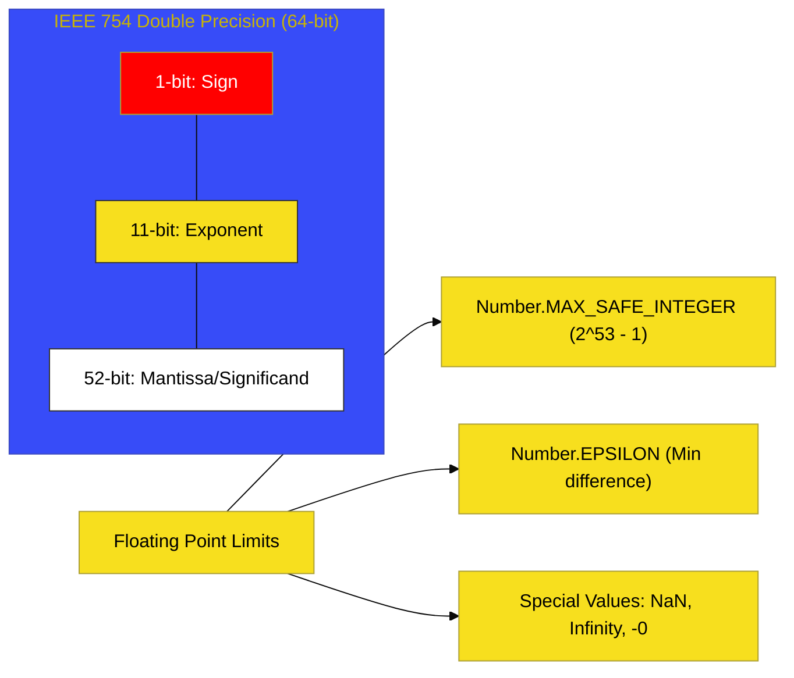

# BK-02: Numeric System

> **"Sistem Timbangan & Akurasi: Membedah Mekanika Komputasi dari Floating Point 64-bit hingga Integer Tanpa Batas."**

---

## 🔗 Source Hub
- **Primary Source**: [ECMA-262: Numeric Types (Clause 6.1.6)](https://tc39.es/ecma262/#sec-numeric-types)
- **Technical Reference**: [IEEE 754 Standard for Floating-Point Arithmetic](https://en.wikipedia.org/wiki/IEEE_754)

---

## 🌓 1. Essence: The Narrative

### Dual Definition
- **Formal**: Arsitektur komputasi numerik ECMAScript yang mendefinisikan perilaku operasional, batas presisi, dan representasi biner untuk tipe **Number** (64-bit double precision) dan **BigInt** (integer presisi tak terbatas).
- **Analogi**: Bayangkan sebuah **"Kalkulator Dua Mode"**. Mode pertama adalah **Kalkulator Ilmiah (Number)**: sangat cepat dan bisa menangani desimal, namun karena keterbatasan memori biner, ia sering membulatkan angka-angka yang sangat kecil. Mode kedua adalah **Kalkulator Akuntansi Raksasa (BigInt)**: lambat namun sangat jujur; ia tidak pernah membulatkan angka, seberapapun besarnya, asalkan angka tersebut adalah bilangan bulat.

---

## 🗺️ 2. Visual Logic: The Number Bit-Map
Representasi internal memori untuk tipe `Number` (IEEE 754):

---

## 🏛️ 3. Structure: The Chapters

1.  **[CH-01: The Number Type & IEEE 754](./CH-01_NumberTypeBasics/)**
    *Bedah teknis desimal 64-bit, NaN, Infinity, dan limitasi biner.*
2.  **[CH-02: Number Arithmetic and Comparison](./CH-02_NumberArithmeticComparison/)**
    *Algoritma matematika dasar dan mekanisme pembulatan.*
3.  **[CH-03: The BigInt Type & Operations](./CH-03_BigIntTypeOperations/)**
    *Integer raksasa, presisi mutlak, dan batasan interoperabilitas.*
4.  **[CH-04: Mathematical Values and Clamping](./CH-04_SpecMathClamping/)**
    *Transformasi nilai ideal ke realita batas memori (Uint8/Uint32).*

---

## 🧠 4. Under-the-hood: The 0.1 + 0.2 Trap
Di BK-02, kita memecahkan misteri mengapa `0.1 + 0.2 !== 0.3`. Hal ini terjadi karena angka desimal `0.1` dan `0.2` tidak dapat direpresentasikan secara presisi dalam sistem biner (mereka menjadi deretan angka berulang). 

Engine akan membulatkan angka tersebut ke representasi IEEE 754 terdekat, sehingga hasil penjumlahannya sedikit melesat dari `0.3` yang ideal. Pemahaman tentang **Mantissa** dan **Exponent** di sini akan memberikan Anda kearifan untuk tidak pernah membandingkan hasil perhitungan uang (currency) menggunakan tipe `Number` secara langsung tanpa pembulatan.

---
*Buku Status: [status.md](../../status.md) | Kembali ke [SR-02](../README.md)*
