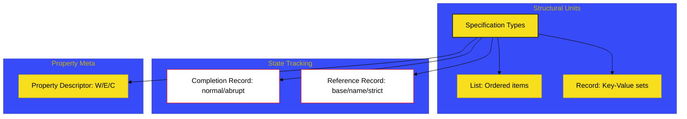

# BK-03: Specification Meta-Types


> **"Perkakas & Sensor Gaib: Membedah Tipe Data Internal yang Mengatur Perilaku Engine Namun Tak Kasat Mata Bagi User."**

---

## 🔗 Source Hub
- **Primary Source**: [ECMA-262: ECMAScript Specification Types (Clause 6.2)](https://tc39.es/ecma262/#sec-ecmascript-specification-types)
- **Technical Reference**: [ECMA-262: The Reference Record (Clause 6.2.5)](https://tc39.es/ecma262/#sec-reference-record-specification-type)

---

## 🌓 1. Essence: The Narrative

### Dual Definition
- **Formal**: Entitas meta-data internal yang digunakan oleh spesifikasi ECMA-262 untuk menjelaskan status eksekusi, struktur data internal, dan deskripsi properti. **Specification Types** (seperti Record, List, Completion, dan Reference) tidak pernah muncul di runtime dan tidak dapat dimanipulasi oleh pemrogram.
- **Analogi**: Bayangkan Anda sedang melihat **"Papan Skor Digital"** di stadion. Anda hanya melihat angka skor (Language Types). Namun, di balik papan tersebut, ada jutaan sirkuit dan register data (**Specification Types**) yang menghitung setiap detik dan poin. Anda tidak bisa menyentuh sirkuit tersebut, tapi tanpa mereka, papan skor tidak akan pernah berfungsi.

---

## 🗺️ 2. Visual Logic: The Meta-Structure Architecture
Struktur data "gaib" yang mengelola integritas bahasa:



---

## 🏛️ 3. Structure: The Chapters

1.  **[CH-01: List, Record, dan Enum](./CH-01_ListRecordEnum/)**
    *Infrastruktur data statis di balik sirkuit Hub.*
2.  **[CH-02: Completion Records and Flow Control](./CH-02_CompletionRecordsFlow/)**
    *Protokol transmisi sukses (`normal`) dan interupsi (`abrupt`).*
3.  **[CH-03: Reference Records and Environment](./CH-03_ReferenceRecordsEnvironment/)**
    *Infrastruktur resolusi variabel dan status kompas identitas.*
4.  **[CH-04: Property Descriptors and Data Blocks](./CH-04_DescriptorsDataBlocks/)**
    *Kontrol meta-data properti dan alokasi blok memori mentah.*
5.  **[CH-05: Private Elements and Class Statics](./CH-05_PrivateElementsClassStatics/)**
    *Mekanika enkapsulasi sirkuit privat (#).*

---

## 🧠 4. Under-the-hood: The "Reference" Record
Salah satu konsep paling krusial di BK-03 adalah **Reference Record**. Ini adalah alasan mengapa kode berikut menghasilkan error:
```javascript
"abc".x = 10; // TypeError in Strict Mode
```
Secara internal, engine membuat sebuah `Reference Record` untuk `"abc".x`. Record ini menyimpan informasi bahwa `[[Base]]` adalah sebuah String (Primitif). Saat operasi **`PutValue`** dijalankan, engine melihat base-nya bukan objek dan modenya adalah **Strict**, sehingga ia melemparkan `TypeError` sesuai aturan spesifikasi 6.2.5.6. 

Tanpa pemahaman meta-type ini, Anda hanya akan menganggap hal tersebut sebagai "perilaku bawaan", padahal itu adalah hasil dari algoritma sensor yang sangat presisi.

---
*Buku Status: [status.md](../../status.md) | Kembali ke [SR-02](../README.md)*
